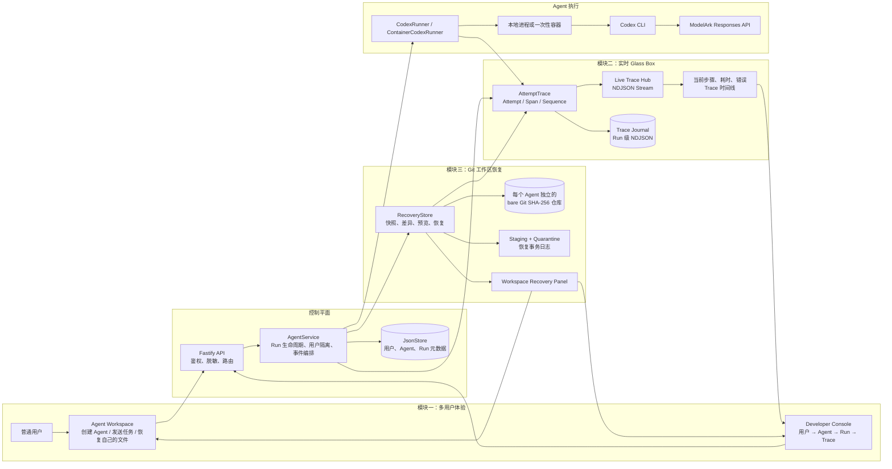

# Glass Box Console / Agent Launchpad

[中文](#中文) · [English](#english)

> A multi-user Agent workspace with real-time execution observability and safe workspace recovery.

---

# 中文

## 项目简介

Glass Box Console 基于 Agent Launchpad Starter Kit 构建。项目让一次 Agent 任务变成可查看、可定位、可恢复的执行链路：普通用户在自己的工作区创建 Agent 并完成任务；开发者在受保护的控制台中观察运行步骤、耗时、错误和文件变化；当 Agent 误删或误改文件时，用户可以先预览再安全恢复。

| 交付模块 | 解决的问题 | 演示中可看到的结果 |
| --- | --- | --- |
| 模块一：多用户产品与控制台 | 用户、Agent 和运行记录缺少清晰边界 | 注册/登录、Agent 管理、所有权隔离、用户/Agent/Run 分层控制台、搜索和统计 |
| 模块二：实时 Glass Box Trace | 只能等 Run 结束后才能知道发生了什么 | 运行中实时步骤、持续计时、模型/工具事件、错误定位、稳定 ID 与 Trace 时间线 |
| 模块三：Git 工作区恢复 | Agent 误删、误改或生成错误文件后无法可靠恢复 | Run 前后检查点、文件差异、冲突预览、选择性恢复、安全快照和恢复审计 |

三项能力共享同一个 Run 生命周期：Run 启动时创建工作区检查点；运行过程中实时产生 Trace；运行结束后生成文件差异；需要时用户选择文件、预览冲突并恢复。每一步都能关联到同一个 Run。

## 整合架构图

## 核心能力

### 多用户 Agent Workspace

- 用户注册、登录、会话隔离和 Agent 所有权校验；
- 创建、编辑、启动、停止和删除 Agent；
- Agent 在隔离工作区中调用 Codex CLI；
- 普通用户只能查看和操作自己的 Agent 与 Run；
- Developer Console 可按用户、Agent、状态或 Run ID 逐层排查。

### 实时 Trace 与失败诊断

每个 Run 使用稳定的 <code>runId</code>、<code>traceId</code>、<code>eventId</code>、<code>spanId</code>、<code>attemptId</code> 和递增的 <code>sequence</code>。

| 事件示例 | 含义 |
| --- | --- |
| <code>run.started</code> / <code>runtime.started</code> | Run 与运行环境已开始 |
| <code>attempt.started</code> / <code>attempt.failed</code> | 一次执行尝试开始或失败 |
| <code>model.requested</code> / <code>model.completed</code> | 模型回合状态 |
| <code>tool.started</code> / <code>tool.failed</code> | 工具或命令状态 |
| <code>file.changed</code> | 工作区出现文件变化 |
| <code>workspace.checkpoint.created</code> | 已创建可恢复检查点 |
| <code>workspace.restore.completed</code> | 恢复完成并通过校验 |
| <code>run.completed</code> / <code>run.failed</code> | Run 终态 |

开发者页面通过 <code>GET /api/developer/runs/:runId/stream</code> 接收 NDJSON 实时流：先加载快照，再接收增量事件；断线后由最终 Trace 与轮询补齐。运行中的事件也写入 Run 级 Journal，服务重启后可以恢复已落盘事件。

<code>tool.failed</code> 不一定等于 <code>run.failed</code>：Agent 可以解释工具失败后正常结束。项目已提供 Attempt/Retry 的观测契约，但没有宣称已实现自动重试、备用模型或自动回退策略。

### Git 工作区恢复

每个 Agent 在 Run 前后创建检查点。检查点保存在平台侧独立的 bare Git SHA-256 仓库中，Agent 工作区本身没有平台 <code>.git</code>，因此无法篡改恢复历史。

- 展示本次 Run 创建、修改、删除的文件；
- 只恢复用户选择的路径；
- 恢复前预览 create / replace / delete 动作和冲突；
- 恢复前创建 safety snapshot；
- 用 staging、quarantine 和事务日志发布恢复结果；
- 通过 <code>workspace.restore.completed</code> Trace 留下审计记录。

恢复只覆盖平台管理的工作区文件，不能撤销已消耗 Token、外部 API、数据库、邮件、支付等工作区外副作用。

## 快速开始

### 前置条件

- Node.js 22+、npm 10+；
- Git 2.29+，并支持 SHA-256 object format；
- Docker Desktop、Colima 或 Podman 中至少一个可用；
- 可用的 ModelArk API Key、Endpoint / Model ID 与正确区域 URL。

获取代码：

    git clone https://github.com/xiaochenwang860-png/trace1-Agent-.git
    cd trace1-Agent-
    npm ci

如果项目已在本机 <code>~/CodeJam</code>，直接进入该目录即可。

安全输入配置。输入 Key 或密码时，终端不会显示字符，这是正常的：

    read -s "ARK_API_KEY?粘贴 ModelArk API Key 后按回车： "
    echo
    read "ARK_MODEL?粘贴 Endpoint / Model ID 后按回车： "
    read -s "TRACE_VIEWER_TOKEN?设置开发者控制台密码后按回车： "
    echo
    export ARK_API_KEY ARK_MODEL TRACE_VIEWER_TOKEN
    export ARK_BASE_URL="https://ark.ap-southeast.bytepluses.com/api/v3"
    npm run dev

请以 ModelArk 控制台 Sample Code 中显示的服务地址为准。北京区域通常使用：

    export ARK_BASE_URL="https://ark.cn-beijing.volces.com/api/v3"

| 服务 | 开发模式地址 |
| --- | --- |
| Agent Workspace | <code>http://localhost:5173/</code> |
| Developer Console | <code>http://localhost:5173/developer</code> |
| API health | <code>http://localhost:3000/api/health</code> |

使用 <code>npm run poc</code> 时，前端由服务端提供，入口变为 <code>http://localhost:3000/</code> 与 <code>http://localhost:3000/developer</code>。

不要提交、截图或分享 API Key、密码、<code>TRACE_VIEWER_TOKEN</code>、<code>RECOVERY_OPERATOR_TOKEN</code>、<code>.env</code> 或本地工作区数据。

## 三个模块的验证方法

### 验证模块一：多用户与控制台

1. 在 Agent Workspace 注册两个测试账号；
2. 每个账号创建一个 Agent；
3. 账号 A 登录时，确认看不到账号 B 的 Agent；
4. 打开 Developer Console，输入启动时设置的 <code>TRACE_VIEWER_TOKEN</code>；
5. 查看总览卡片、用户列表、Agent 列表和 Run 详情。

### 验证模块二：实时 Trace 与失败定位

1. 保持 Developer Console 打开；
2. 在普通用户页面创建或选择一个 Agent；
3. 发送一个会持续数秒并创建文件的任务；
4. 在 Run 仍为 running 时进入对应 Run，确认当前步骤、工具事件和耗时已显示；
5. 再发送确定性失败任务：

    请只执行命令 bash -lc 'exit 42'。不要重试，不要修改文件。根据工具返回的信息说明发生了什么。

6. 在 Developer Console 中确认 <code>tool.started → tool.failed</code> 和退出码 <code>42</code>。

完整自动化行为矩阵会创建 6 个独立 Agent/Run、最大并发 3，并验证实时到达、顺序、Span 配对和 Run 隔离。它会调用真实模型：

    npm run demo:matrix -- --dry-run
    npm run demo:matrix -- --case slow-success --case tool-failure --concurrency 2
    npm run demo:matrix

矩阵运行前需要在第二个终端设置 <code>DEMO_USER_NAME</code>、<code>DEMO_USER_PASSWORD</code> 和 <code>DEMO_TRACE_TOKEN</code>。完整操作见 [Glass Box 行为矩阵](docs/DEMO_MATRIX.md)。

### 验证模块三：错误文件恢复

在同一个新建 Agent 中执行两次 Run。

第一次 Run 创建正确版本：

    只能修改 recovery-smoke-test 文件夹。
    创建 recovery-smoke-test/important.txt，内容为 ORIGINAL IMPORTANT CONTENT。
    创建 recovery-smoke-test/settings.json，内容为 {"enabled":true,"mode":"stable","version":1}。
    读取两个文件并确认内容，然后结束。

第二次 Run 模拟误操作：

    只能修改 recovery-smoke-test 文件夹。
    删除 recovery-smoke-test/important.txt。
    将 recovery-smoke-test/settings.json 改为 {"enabled":false,"mode":"broken","version":2}。
    创建 recovery-smoke-test/unwanted.txt，内容为 UNWANTED FILE。
    报告修改结果后结束，不要自行恢复。

在第二次 Run 下方的 <strong>Workspace Recovery / Recovery point</strong> 面板中：

1. 确认 Total 为 3，Created、Modified、Deleted 各为 1；
2. 点击 <strong>Select all</strong>；
3. 点击 <strong>Preview selected</strong> 或 <strong>Preview all changes</strong>；
4. 确认显示 <strong>No conflicts</strong>；
5. 点击 <strong>Restore 3 paths</strong>；
6. 确认显示 <strong>Workspace restored</strong> 与 safety snapshot。

恢复后，<code>important.txt</code> 与原始 <code>settings.json</code> 应存在，<code>unwanted.txt</code> 应不存在。普通用户恢复自己的 Run 不需要额外 Token；Developer Console 跨用户恢复还需要独立的 <code>RECOVERY_OPERATOR_TOKEN</code>，且它不能与查看 Token 相同。

详细恢复流程见 [API and Rollback Demo](docs/ROLLBACK_DEMO.md) 与 [Workspace Recovery](docs/WORKSPACE_RECOVERY.md)。

## 开发与检查

| 命令 | 用途 |
| --- | --- |
| <code>npm run dev</code> | 启动前后端开发模式 |
| <code>npm run poc</code> | 构建并启动本地容器 POC |
| <code>npm run test:matrix</code> | 运行 Trace 矩阵自动化测试 |
| <code>npm run demo:matrix</code> | 对真实服务与模型执行演示矩阵 |
| <code>npm run typecheck</code> | TypeScript 类型检查 |
| <code>npm run build</code> | 构建前端与后端 |
| <code>npm run check</code> | 类型检查、测试和构建 |

提交或展示前建议执行：

    npm run check
    git status

## 安全与边界

- Key、Token、密码和常见凭据格式会在存储、展示和错误输出中脱敏；
- 用户密码和会话标识以哈希形式保存；
- Developer 概览不会无差别返回完整 Prompt、工作区内容或完整模型输出；
- 恢复仓库可能包含工作区文件，应放在受限、加密且有保留策略的存储中；
- 当前项目是单控制平面进程的黑客松 POC，不应宣称已完成大规模并发压测、P95/P99 性能承诺或真实自动回退策略。

更多文档：

- [Architecture](docs/ARCHITECTURE.md)
- [Glass Box work summary](docs/GLASS_BOX_WORK_SUMMARY.md)
- [Trace behavior matrix](docs/DEMO_MATRIX.md)
- [Updated features](docs/UPDATED_FEATURES.md)
- [Workspace recovery](docs/WORKSPACE_RECOVERY.md)
- [API and rollback demo](docs/ROLLBACK_DEMO.md)

---

# English

## Overview

Glass Box Console extends Agent Launchpad with three integrated deliverables:

1. a multi-user Agent workspace and developer console;
2. live, correlated execution traces and failure diagnostics;
3. Git SHA-256 checkpoint-based workspace recovery.

The shared architecture diagram above shows how the three workstreams meet in one Run lifecycle: the Agent emits live trace events while its workspace is checkpointed before and after execution.

## Integrated workstreams

| Workstream | Outcome |
| --- | --- |
| Multi-user product and console | User sign-in, ownership boundaries, Agent lifecycle management, user/Agent/Run drill-down, search, and metrics |
| Live Glass Box Trace | NDJSON live stream, current-step timing, stable Run/Attempt/Span identifiers, diagnostics, and a durable trace journal |
| Git workspace recovery | Per-Agent bare Git SHA-256 checkpoints, change summaries, conflict previews, selective restore, safety snapshots, and audit events |

## Core behavior

- Regular users can access only their own Agents and runs.
- Developers unlock observability with <code>TRACE_VIEWER_TOKEN</code>.
- Live Trace is streamed from <code>GET /api/developer/runs/:runId/stream</code>.
- Events have stable <code>runId</code>, <code>traceId</code>, <code>eventId</code>, <code>spanId</code>, <code>attemptId</code>, and monotonic <code>sequence</code>.
- A visible <code>tool.failed</code> event does not necessarily make the final run fail; the Agent may explain and finish normally.
- Every Run is checkpointed before and after execution. Restore is previewed and selective; it never runs <code>git reset --hard</code> in the live Agent workspace.
- AttemptTrace supplies an observable contract for future retry policy. Automatic fallback or retry is not claimed.

## Quick start

Requirements: Node.js 22+, npm 10+, Git 2.29+ with SHA-256 object support, Docker Desktop/Colima/Podman, and compatible ModelArk credentials.

    git clone https://github.com/xiaochenwang860-png/trace1-Agent-.git
    cd trace1-Agent-
    npm ci

Set secrets only in the current terminal session:

    read -s "ARK_API_KEY?Paste ModelArk API Key: "
    echo
    read "ARK_MODEL?Paste Endpoint / Model ID: "
    read -s "TRACE_VIEWER_TOKEN?Set Developer Console password: "
    echo
    export ARK_API_KEY ARK_MODEL TRACE_VIEWER_TOKEN
    export ARK_BASE_URL="https://ark.ap-southeast.bytepluses.com/api/v3"
    npm run dev

Use the regional URL shown by ModelArk sample code. The Beijing endpoint is commonly:

    export ARK_BASE_URL="https://ark.cn-beijing.volces.com/api/v3"

| Service | Development URL |
| --- | --- |
| Agent Workspace | <code>http://localhost:5173/</code> |
| Developer Console | <code>http://localhost:5173/developer</code> |
| API health check | <code>http://localhost:3000/api/health</code> |

## Validation guide

### Live Trace

Keep Developer Console open, create a new run, and open it before completion. Current activity, duration, model/tool events, and file changes should be visible. For a deterministic failure:

    Run only: bash -lc 'exit 42'.
    Do not retry and do not modify files. Explain the tool result.

The console should show <code>tool.started</code>, <code>tool.failed</code>, and exit code 42. For the repeatable six-Run matrix, see [Trace behavior matrix](docs/DEMO_MATRIX.md):

    npm run demo:matrix -- --dry-run
    npm run demo:matrix -- --case slow-success --case tool-failure --concurrency 2
    npm run demo:matrix

### Workspace recovery

Use one dedicated Agent. First create a correct file, then in a later Run delete or modify it and create an unwanted file. Under that later Run, open <strong>Workspace Recovery</strong>, select paths, preview the actions, verify <strong>No conflicts</strong>, then choose <strong>Restore</strong>.

Success proof is <strong>Workspace restored</strong>, a safety snapshot ID, restored file content, and a correlated <code>workspace.restore.completed</code> event. The owner can restore their own Run. A cross-user Developer Console restore additionally needs a distinct <code>RECOVERY_OPERATOR_TOKEN</code>. The full controlled scenario is in [API and Rollback Demo](docs/ROLLBACK_DEMO.md).

## Video demo script

Use the bilingual three-minute script in the Chinese section above:

1. introduce the visibility problem;
2. show multi-user Agent ownership;
3. show live activity before a Run finishes;
4. locate a tool failure;
5. preview and restore workspace changes;
6. conclude with matrix evidence and the three-module value.

Do not record API keys, passwords, tokens, environment files, or private workspace paths. The matrix is repeatable functional evidence, not a production-scale performance benchmark.

## Development and references

| Command | Purpose |
| --- | --- |
| <code>npm run dev</code> | Start web and API development servers |
| <code>npm run poc</code> | Build and run the local container POC |
| <code>npm run test:matrix</code> | Run automated Trace matrix tests |
| <code>npm run demo:matrix</code> | Run the live demo matrix against configured services |
| <code>npm run check</code> | Typecheck, test, and build |

Before sharing or submitting:

    npm run check
    git status

Further reading:

- [Architecture](docs/ARCHITECTURE.md)
- [Glass Box work summary](docs/GLASS_BOX_WORK_SUMMARY.md)
- [Trace behavior matrix](docs/DEMO_MATRIX.md)
- [Updated features](docs/UPDATED_FEATURES.md)
- [Workspace recovery](docs/WORKSPACE_RECOVERY.md)
- [API and rollback demo](docs/ROLLBACK_DEMO.md)

Licensed under the [MIT License](LICENSE).
