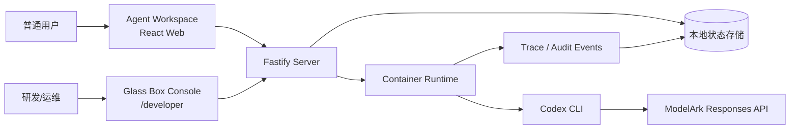

# Glass Box Console / Agent Launchpad

[中文](#中文说明) · [English](#english)

> A multi-user Agent workspace with developer-only observability: inspect Agent runs, model calls, tool use, file changes, failures, and complete traces without exposing sensitive content to ordinary users.


---

<a id="中文说明"></a>

# 中文说明

## 1. 项目简介

**Glass Box Console** 是一个面向 Agent 平台的可观测性增强项目，基于官方提供的 Agent Launchpad Starter Kit 开发。

它将产品分为两个明确的界面：

| 角色 | 入口 | 可以做什么 |
| --- | --- | --- |
| 普通用户 | `http://localhost:3000/` | 注册/登录、创建自己的 Agent、向 Agent 下达任务、查看自己的对话结果 |
| 研发或运维人员 | `http://localhost:3000/developer` | 查看全部用户、全部 Agent、每次运行、Trace 时间线、Token 用量和失败诊断 |

普通用户只能看到自己创建的 Agent；开发者控制台在授权后可以跨用户查看运行数据，从“用户 → Agent → 单次运行 → 完整 Trace”逐层排查问题。

## 2. 已实现能力

### Agent 工作区

- 用户注册、登录和会话隔离
- 每位用户只能访问自己拥有的 Agent
- 创建、编辑、启动、停止、删除 Agent
- Agent 在容器隔离的工作区中执行任务
- 使用 Codex CLI 处理文件、代码和命令行任务
- 与 Agent 的多轮对话和运行记录保存

### Glass Box 开发者控制台

- 使用单独的 `TRACE_VIEWER_TOKEN` 保护开发者入口
- 登录后只需验证一次；随后可在控制台内切换用户、Agent 和运行记录
- 总览所有注册用户、Agent 数量、运行总数和失败数量
- 支持按用户名、Agent、状态或 Run ID 搜索
- 点击用户查看该用户的所有 Agent 和汇总指标
- 点击 Agent 查看其运行记录与完整 Trace
- 点击单次运行查看事件卡片、时间线、Token 用量与诊断信息
- 支持 JSON 导出，便于比赛展示或后续接入分析系统
- 页面自动轮询更新，新的运行和错误会自动出现

### Trace / 审计事件

每一次运行都会生成稳定的 `Trace ID`、`Span ID` 和 `Parent Span ID`，并记录以下事件：

| 事件 | 含义 |
| --- | --- |
| `run.started` | 平台接收任务并创建运行记录 |
| `runtime.started` | Agent 容器运行环境开始执行 |
| `model.requested` | Codex 模型回合开始 |
| `model.completed` | Codex 模型回合完成 |
| `tool.started` | Agent 开始调用工具或命令 |
| `tool.completed` | 工具或命令执行成功 |
| `tool.failed` | 工具或命令执行失败 |
| `file.changed` | Agent 在隔离工作区创建、修改或删除文件 |
| `run.completed` | 整个 Agent 运行完成 |
| `run.failed` | 运行失败并记录诊断信息 |
| `run.cancelled` | 运行被取消 |

其中：

- **Trace ID**：一次完整任务链路的编号。本项目 POC 中通常与 Run ID 对应。
- **Span ID**：链路中某一个独立步骤的编号。
- **Parent Span ID**：该步骤的上游步骤编号，用于还原执行层级。
- **Duration**：事件或运行耗时。
- **Token usage**：输入、缓存输入和输出 Token 的统计。

### 数据安全与脱敏

- API Key、Bearer Token、密码和常见密钥格式会在保存、展示、错误输出和日志中脱敏。
- Agent 指令、完整提示词、模型输出、工作区路径等敏感字段不会通过开发者总览 API 全量暴露。
- 用户密码采用加盐哈希保存；会话标识采用哈希处理。
- `.env`、本地数据、工作区、Codex 运行目录、依赖目录等已排除在 Git 版本控制之外。
- 这是比赛 POC，若投入生产，仍应增加 HTTPS、权限体系、数据库加密、审计保留策略、速率限制和集中式日志服务。

## 3. 系统架构



## 4. 项目目录

```text
CodeJam/
├── apps/
│   ├── server/                 # Fastify 后端、鉴权、Agent 服务、Trace 和脱敏
│   └── web/                    # React 前端：用户工作区和开发者控制台
├── scripts/
│   └── start-local-poc.sh      # 一键本地 POC 启动脚本
├── docs/                       # 架构、部署和扩展文档
├── .env.example                # 环境变量示例（不含真实密钥）
├── package.json                # 项目脚本
└── README.md
```

## 5. 运行前准备

请准备：

1. macOS 或 Linux。
2. Node.js **22 或以上**，npm **10 或以上**。
3. 一个已启动的容器引擎：Docker Desktop、Colima 或 Podman 三选一。
4. BytePlus / ModelArk 的：
   - `ARK_API_KEY`：ModelArk API Key；
   - `ARK_MODEL`：已激活模型的 Endpoint / Model ID；
   - 正确的服务区域 URL（以 ModelArk 控制台生成的调用示例为准）。
5. 一个你自己设置的开发者控制台密码：`TRACE_VIEWER_TOKEN`。

检查本机环境：

```bash
git --version
node --version
npm --version
docker --version
```

> Docker Desktop 必须处于运行状态；若 Docker 没启动，`npm run poc` 会提示找不到容器引擎。

## 6. 从零运行

### 6.1 获取代码

```bash
git clone https://github.com/<your-github-name>/<your-repository>.git
cd CodeJam
```

### 6.2 安全地输入密钥并启动

在项目根目录执行下面的命令。使用 `read -s` 输入 API Key 和开发者密码时，终端不会显示内容，也不会把密钥写进命令历史。

```bash
read -s "ARK_API_KEY?粘贴 ModelArk API Key 后按回车： "
echo
read "ARK_MODEL?粘贴 Endpoint / Model ID 后按回车： "
read -s "TRACE_VIEWER_TOKEN?设置开发者控制台密码后按回车： "
echo

export ARK_API_KEY ARK_MODEL TRACE_VIEWER_TOKEN
export ARK_BASE_URL="https://ark.ap-southeast.bytepluses.com/api/v3"

npm run poc
```

如果你的 ModelArk 控制台示例显示的是北京区域，请改为：

```bash
export ARK_BASE_URL="https://ark.cn-beijing.volces.com/api/v3"
```

**务必以 ModelArk 控制台的 Sample Code 中显示的服务地址为准。** API Key、模型 Endpoint 和服务区域不匹配时，常见错误是 `401 Unauthorized`。

首次运行会自动安装依赖、构建前后端、构建容器 Runtime，然后启动服务。完成后终端会显示：

```text
Agent workspace: http://localhost:3000
Developer console: http://localhost:3000/developer
```

启动成功后保持这个终端窗口不要关闭。要停止服务，回到该终端按 `Control + C`。

## 7. 推荐演示流程

### 7.1 普通用户界面

1. 打开 `http://localhost:3000/`。
2. 注册一个用户账户或登录已有账户。
3. 创建一个 Agent，例如 `Demo Agent`。
4. 给 Agent 发送任务，例如：

```text
请在工作区创建 hello.txt，内容为 Hello from my first agent。
完成后告诉我文件路径和内容。
```

5. Agent 完成后，会返回文件路径和结果。该文件位于 Agent 对应的隔离工作区中。

### 7.2 开发者控制台

1. 打开 `http://localhost:3000/developer`。
2. 输入启动时设置的 `TRACE_VIEWER_TOKEN`。
3. 先查看用户总览，再选择用户。
4. 在用户详情中选择一个 Agent。
5. 在 Agent 详情中选择某一次 Run，即可查看：
   - Run ID、状态、开始时间和总耗时；
   - 输入/缓存/输出 Token；
   - 事件卡片；
   - Trace 时间线；
   - 文件变更、工具调用和失败原因；
   - 脱敏后的诊断信息；
   - JSON 导出。

### 7.3 失败诊断演示

可以让 Agent 只执行一条会失败的命令：

```text
请只执行命令 bash -lc 'exit 7'。不要重试，不要修改文件。根据工具返回的信息说明发生了什么。
```

控制台应出现 `tool.failed`，并展示非零退出码。这样可以演示“普通用户看到任务结果，研发人员能看到底层失败步骤”的区别。

## 8. 常用命令

| 命令 | 用途 |
| --- | --- |
| `npm run poc` | 一键构建并启动本地容器 POC |
| `npm run dev` | 前后端开发模式 |
| `npm run build` | 构建前端与后端 |
| `npm run typecheck` | TypeScript 类型检查 |
| `npm run test` | 运行后端测试 |
| `npm run check` | 依次运行类型检查、测试和构建 |
| `npm run start` | 启动已构建的后端服务 |

开发模式默认使用：

| 服务 | 地址 |
| --- | --- |
| Web 前端 | `http://localhost:5173` |
| API 服务 | `http://localhost:3000` |

## 9. 常见问题

| 现象 | 原因 | 处理方式 |
| --- | --- | --- |
| `ENOENT package.json` | 在错误目录执行了 npm 命令 | 先执行 `cd ~/CodeJam` |
| 找不到 Docker / Colima / Podman | 容器引擎未安装或未启动 | 安装并启动 Docker Desktop，或启动 Colima/Podman |
| `EADDRINUSE: 3000` | 3000 端口已被旧服务占用 | 关闭旧终端中的服务，或结束占用 3000 的进程 |
| `ARK_API_KEY and ARK_MODEL are required` | 当前终端没有设置环境变量 | 重新按第 6.2 节输入并导出变量 |
| `401 Unauthorized` | Key 无效、复制不完整，或 Key/模型与区域不匹配 | 在 ModelArk 控制台重新生成/复制 Key，并使用正确 `ARK_BASE_URL` |
| 开发者页面提示 token 无效 | 输入的密码与启动时 `TRACE_VIEWER_TOKEN` 不同 | 停止服务后重新设置 token 再启动 |
| 刷新页面后服务无法访问 | 启动服务的终端已关闭 | 按第 6.2 节重新启动 `npm run poc` |

## 10. 测试与提交前检查

提交前推荐执行：

```bash
npm run check
git status
```

确认：

- 测试、类型检查和构建全部通过；
- 没有提交 `.env`、真实 Key、开发者控制台密码、本地数据或工作区文件；
- README 中的仓库地址、截图和演示步骤符合当前版本；

---

<a id="english"></a>

# English

## 1. Overview

**Glass Box Console** extends the provided Agent Launchpad Starter Kit with developer-only observability for a multi-user Agent platform.

The product has two deliberately separate experiences:

| Role | URL | What it can do |
| --- | --- | --- |
| Regular user | `http://localhost:3000/` | Sign up/sign in, create owned Agents, send tasks, and read personal results |
| Developer / operator | `http://localhost:3000/developer` | Inspect users, Agents, runs, complete traces, token usage, and diagnostics |

Users can only access their own Agents. Authorized developers can drill down from **user → Agent → run → full trace**.

## 2. Key Features

- Multi-user registration, login, ownership checks, and session isolation.
- Agent creation, update, start, stop, delete, and conversational task execution.
- Container-isolated Agent workspaces powered by Codex CLI and ModelArk.
- Developer Console protected by a separate `TRACE_VIEWER_TOKEN`.
- One-time developer authentication per browser session.
- Global overview of users, Agents, runs, and failed runs.
- Search by user, Agent, run status, or Run ID.
- User, Agent, run, and trace drill-down pages.
- Automatic refresh for new execution activity.
- JSON export for demos and downstream analysis.
- Trace waterfall timeline, event cards, file changes, tool calls, token usage, and diagnostics.
- Sensitive-data redaction for credentials, prompts, outputs, errors, and telemetry fields.

## 3. Trace Events

A run records the following event types:

```text
run.started       runtime.started     model.requested
model.completed   tool.started        tool.completed
tool.failed       file.changed        run.completed
run.failed        run.cancelled
```

Every event is correlated through stable **Trace ID**, **Span ID**, and **Parent Span ID** values. In this POC, the Trace ID normally maps to the run.

## 4. Prerequisites

- macOS or Linux
- Node.js 22+ and npm 10+
- One running container engine: Docker Desktop, Colima, or Podman
- A BytePlus / ModelArk API key
- An activated ModelArk Endpoint / Model ID
- The ModelArk endpoint URL matching the selected region
- A self-chosen Developer Console password (`TRACE_VIEWER_TOKEN`)

## 5. Quick Start

Clone the repository and open the project directory:

```bash
git clone https://github.com/<your-github-name>/<your-repository>.git
cd CodeJam
```

Start Docker Desktop (or another supported container engine), then run the following in the repository root:

```bash
read -s "ARK_API_KEY?Paste your ModelArk API Key and press Enter: "
echo
read "ARK_MODEL?Paste your Endpoint / Model ID and press Enter: "
read -s "TRACE_VIEWER_TOKEN?Set a Developer Console password and press Enter: "
echo

export ARK_API_KEY ARK_MODEL TRACE_VIEWER_TOKEN
export ARK_BASE_URL="https://ark.ap-southeast.bytepluses.com/api/v3"

npm run poc
```

For a Beijing-region ModelArk endpoint, use:

```bash
export ARK_BASE_URL="https://ark.cn-beijing.volces.com/api/v3"
```

Always use the URL shown in your ModelArk console sample code. Do **not** add any real key or token to this README, Git, screenshots, or chat logs.

When the service is ready, open:

- Agent Workspace: `http://localhost:3000/`
- Developer Console: `http://localhost:3000/developer`

Keep the terminal open while the app is running. Press `Control + C` in that terminal to stop it.

## 6. Demo Script

1. Register a regular user at the Agent Workspace.
2. Create an Agent.
3. Send this task:

```text
Create hello.txt in the workspace with the content:
Hello from my first agent.
Then report the file path and its content.
```

4. Open the Developer Console and authenticate with `TRACE_VIEWER_TOKEN`.
5. Browse the user list, select the user, select the Agent, then open the run.
6. Review model activity, file changes, tool calls, duration, token usage, and the trace timeline.
7. Optional failure demo:

```text
Run only: bash -lc 'exit 7'.
Do not retry and do not change files. Explain the tool result.
```

The developer console should display a `tool.failed` event and the non-zero exit code.

## 7. Development and Verification

| Command | Purpose |
| --- | --- |
| `npm run poc` | Build and run the local container POC |
| `npm run dev` | Start development mode |
| `npm run build` | Build web and server packages |
| `npm run typecheck` | Run TypeScript checks |
| `npm run test` | Run server tests |
| `npm run check` | Typecheck, test, and build |
| `npm run start` | Start the built server |

Before opening a pull request or sharing the project, run:

```bash
npm run check
git status
```

## 8. Security Notes

- Credentials and common secret formats are redacted before persistence and telemetry display.
- User passwords and sessions are stored as hashes, not plaintext.
- Developer APIs do not return full Agent instructions, workspaces, raw prompts, or complete model outputs in overview views.
- `.env`, local state, workspaces, runtime directories, and dependencies are ignored by Git.
- This repository is a hackathon POC. Production deployment should add HTTPS, role-based access control, database encryption, rate limiting, retention policies, and centralized logging.

## 9. Troubleshooting

| Problem | Likely cause | Fix |
| --- | --- | --- |
| `ENOENT package.json` | npm was run outside the repository | Run `cd ~/CodeJam` first |
| No container engine found | Docker / Colima / Podman is not running | Start one supported engine |
| `EADDRINUSE: 3000` | Another server already uses port 3000 | Stop the previous process or free the port |
| Missing `ARK_API_KEY` / `ARK_MODEL` | Variables were not set in this terminal | Repeat the Quick Start environment setup |
| `401 Unauthorized` | Invalid key or region/model mismatch | Regenerate/copy the key and match `ARK_BASE_URL` to your ModelArk region |
| Developer token rejected | Wrong `TRACE_VIEWER_TOKEN` | Restart the service with a new token and sign in again |

## 10. Documentation and License

Further references:

- [Architecture](docs/ARCHITECTURE.md)
- [Local POC guide](docs/LOCAL_POC.md)
- [Deployment guide](docs/DEPLOYMENT.md)
- [Hackathon extension guide](docs/HACKATHON_EXTENSION_GUIDE.md)

Licensed under the [MIT License](LICENSE).
