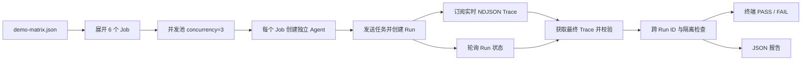

# Glass Box 行为矩阵：操作与视频录制指南

## 1. 为什么做行为矩阵

手工输入一个任务，只能证明“这一次看起来能跑”。它不能稳定证明：

- Trace 是否在 Run 完成前实时到达；
- 多个 Run 是否串线；
- Event、Span 与 Attempt ID 是否正确；
- 错误是否在发生步骤立即可见；
- 实时流与最终持久化 Trace 是否一致；
- 同一套演示能否重复执行并得到可核验的结论。

行为矩阵把**输入、并发执行、实时订阅、结果断言和报告**放在同一条自动化链路中，用于验证 Agent 与 Glass Box 的核心能力，并为黑客松视频生成可复现证据。

它是行为验证与演示工具，不是生产压力测试工具。

## 2. 行为矩阵是什么

矩阵由两个文件组成：

```text
scripts/demo-matrix.json       场景、份数、Prompt 与预期结果
scripts/run-demo-matrix.mjs    执行器、实时订阅、校验与报告
```



执行器会：

1. 校验并展开矩阵；
2. 检查服务健康状态、ModelArk 配置与 Codex Runtime；
3. 使用一个已有演示账号登录；
4. 为每个 Job 创建独立 Agent；
5. 发送任务后同时订阅实时 Trace、轮询 Run；
6. 读取最终 Trace，做单 Run 和跨 Run 校验；
7. 输出汇总表并保存完整 JSON 报告。

## 3. “用户数量”的准确口径

默认配置是：

- **1 个演示账号**；
- **6 个独立 Agent / 6 个独立 Run**；
- **最大并发 3**，分两批完成。

不要在视频中称为“6 个用户压测”。当前脚本验证的是同一账号下的多 Agent/Run 实时观测与隔离。多租户认证隔离需要单独的多账号矩阵。

选择 6/3 的原因：

- 两份慢任务和两份失败任务可以证明相同行为在并发下不串 Trace；
- 比 4 个单例 Run 更有说服力；
- 默认每个容器上限为 2 CPU / 2 GB，并发 3 的理论上限约为 6 CPU / 6 GB；
- 模型调用数量、等待时间和录屏失败概率仍可控。

脚本允许 `concurrency=1～20`、单 Case `copies=1～20`，展开后最多 50 个 Job。这些是输入保护上限，不是性能承诺。需要更强展示时可另做 8 Run / 并发 4 配置，但不建议作为普通笔记本的默认录屏档。

## 4. 默认输入矩阵

| 场景 | 份数 | 输入行为 | 核心证据 |
| --- | ---: | --- | --- |
| `slow-success` | 2 | 运行约 8 秒的命令、创建并检查文件 | Run 完成前收到工具事件；计时增长；文件可审计 |
| `tool-failure` | 2 | 执行退出码 42 的确定性失败，不重试 | `tool.failed` 通过实时流到达；错误包含 42 |
| `file-lifecycle` | 1 | 创建并解析 `audit-demo.json` | 工具成功与 `file.changed` 可见 |
| `ordered-tools` | 1 | 严格分三次执行工具，第二步等待 2 秒 | 至少 3 组工具事件、顺序和稳定 Span 正确 |

矩阵故意同时包含成功、中间失败、慢步骤、文件变化和有序多步骤。`tool.failed` 不一定等于最终 `run.failed`：Agent 可以在工具失败后正常总结错误，所以该 Case 允许 Run 最终为 `completed` 或 `failed`，但底层失败事件必须存在并实时到达。

## 5. 自动校验什么

每个 Run 会检查：

- 最终状态和唯一终态事件；
- 必需 Trace 类型与最小事件数量；
- 指定事件确实来自实时流，而不是只在最终快照出现；
- Run 与慢工具持续时间；
- `sequence` 连续且严格递增；
- Event ID 唯一，Stream 无重复投递；
- 实时流完整且不包含其他 Run 的事件；
- `parentSpanId` 可以在当前 Run 内解析；
- Attempt、Model、Tool 的 started 与 terminal Span 一一配对；
- 错误或摘要包含预期文本。

矩阵结束后还会检查不同 Run 没有复用 `runId` 或 Event ID。

报告同时记录 API 接受耗时、首条 Trace 可见时间、Run 总耗时、最大实时事件年龄、事件数量、Stream 投递数量、运行时类型和每项断言。`maximumLiveEventAgeMs` 会受客户端与服务器时钟差影响，只能用于诊断，不能作为严格网络延迟指标。

## 6. 运行前准备

需要：

1. Node.js 22+、npm 10+，依赖已安装；
2. Docker、Colima 或 Podman 中至少一个可用；
3. 应用已经按 README 启动；
4. ModelArk API Key、模型 Endpoint 和区域正确；
5. 已注册一个普通演示账号；
6. 知道服务使用的 `TRACE_VIEWER_TOKEN`。

先运行仓库全量自动化检查：

```powershell
npm ci
npm run check
```

应用启动方式以 README 为准。`npm run poc` 使用 Bash 脚本，在 Windows 上应通过 WSL 或 Git Bash 运行；矩阵本身可以在 PowerShell 中运行。

## 7. 核心操作指南（PowerShell）

### 7.1 保持服务运行

在第一个终端启动应用并保持窗口打开。默认入口为：

```text
普通用户页面    http://localhost:3000/
Developer Console http://localhost:3000/developer
```

先在普通页面注册或确认演示账号能够登录。

### 7.2 安全设置矩阵认证

在第二个 PowerShell 终端进入仓库根目录：

```powershell
$env:DEMO_USER_NAME = "demo-user"

$userPassword = Read-Host "Demo user password" -AsSecureString
$env:DEMO_USER_PASSWORD = [System.Net.NetworkCredential]::new("", $userPassword).Password

$tracePassword = Read-Host "Trace viewer token" -AsSecureString
$env:DEMO_TRACE_TOKEN = [System.Net.NetworkCredential]::new("", $tracePassword).Password
```

如果服务使用了 `APP_AUTH_TOKEN`，也可将相同值放入 `DEMO_USER_TOKEN`，无需用户名和密码：

```powershell
$env:DEMO_USER_TOKEN = "<existing token>"
```

Token 只从环境变量读取。不要把密码、Token 或 Key 写进矩阵 JSON、命令截图或 Git。

### 7.3 只校验配置

```powershell
npm run demo:matrix -- --dry-run
```

成功输出必须包含：

```text
Jobs: 6; concurrency: 3
```

`--dry-run` 不访问服务器，也不创建 Agent。

### 7.4 录制前 Smoke Test

先跑最关键的两类 Case：

```powershell
npm run demo:matrix -- --case slow-success --case tool-failure --concurrency 2
```

由于这两个 Case 各有两份，这条命令会执行 4 个 Job。它可以提前发现 ModelArk、Runtime、实时失败事件或慢步骤断言的问题。

### 7.5 运行完整矩阵

```powershell
npm run demo:matrix
```

不传参数时就是 6 Job / 并发 3。正式录屏这轮**不要加 `--cleanup`**，这样生成的 Agent 和 Run 会保留在 Developer Console 中。

执行结束后，终端表格最后一列应全部为 `PASS`。报告默认写入：

```text
.data/demo-reports/demo-matrix-<timestamp>.json
```

### 7.6 查看报告

报告摘要应类似：

```json
{
  "summary": {
    "jobs": 6,
    "passed": 6,
    "failed": 0
  }
}
```

不要只看 Run 是不是 `completed`。Run 成功只代表 Agent 返回了结果，矩阵全部 PASS 才代表实时流、ID、顺序和隔离断言都通过。

## 8. 常用参数

只运行慢步骤（默认仍有两份，顺序执行）：

```powershell
npm run demo:matrix -- --case slow-success --concurrency 1
```

连接远程 HTTPS 服务：

```powershell
npm run demo:matrix -- --base-url https://demo.example.com
```

指定报告路径：

```powershell
npm run demo:matrix -- --report .data/demo-reports/video-final.json
```

在本次执行生成报告后立即删除**本次创建**的 Agent：

```powershell
npm run demo:matrix -- --cleanup
```

注意：`--cleanup` 不是清理历史矩阵 Agent 的独立命令，它仍会先执行一轮矩阵，只删除这一轮创建的 Agent。之前为录屏保留的 Agent 应在界面中按 `[Matrix ...]` 名称手工删除。

其他参数可查看：

```powershell
npm run demo:matrix -- --help
```

## 9. 如何读 FAIL

失败时，终端会在对应 Case 下列出断言名称和细节。常见类型：

| 现象 | 优先检查 |
| --- | --- |
| 启动前直接失败 | `/api/system` 中 Ark 是否配置、Codex/容器 Runtime 是否可用 |
| `required-live-events` | 关键事件是否只在最终查询出现，实时流是否提前断开 |
| `continuous-sequence` | 是否重复分配或遗漏 Run 内序号 |
| Span lifecycle 失败 | started 与 completed/failed 是否复用 operation/span ID |
| Stream completeness/isolation 失败 | 断流、漏事件或混入其他 Run |
| Event text 失败 | Prompt 行为与配置文本断言是否一致 |
| Run 超时 | Endpoint/区域、额度、容器、网络和 `timeoutMs` |

脚本即使在 Stream 解析错误或超时后，也会尽量把已收到的部分 Trace 写入失败报告，便于定位断点。

## 10. 视频录制脚本

### 10.1 推荐画面

- 左侧：Developer Console 的选中 Run；
- 右上：矩阵终端；
- 右下：普通 Agent 页面或最终 JSON 报告。

录屏前隐藏 API Key、密码、Trace Token、`.env` 内容和不必要的本地绝对路径。

### 10.2 三分钟演示顺序

1. **问题（20 秒）**：传统方案等 Run 完成后才上传整份 JSON，无法及时知道执行到哪一步。
2. **实时慢步骤（45 秒）**：运行 `slow-success`，打开正在 running 的 Run，展示当前工具和持续增长的计时；任务尚未完成，Trace 已可见。
3. **失败定位（35 秒）**：运行 `tool-failure`，展示 `tool.started → tool.failed`、退出码 42 和具体失败步骤。
4. **完整矩阵（55 秒）**：运行默认矩阵，展示 6 个独立 Agent/Run、并发 3、ID 不串线和最终全部 PASS。
5. **回退接口（15 秒）**：展示 Attempt/Retry 字段，明确这是给队友 Fallback Runner 的观测契约，不宣称回退策略已经实现。
6. **总结（10 秒）**：强调实时投递、稳定关联、失败可见、崩溃日志和可重复验证。

推荐收尾表述：

> Glass Box 不等待 Agent 完成后再接收整份 JSON，而是在执行过程中逐步获得模型、工具、文件和失败事件。稳定的 Run、Attempt 与 Span ID 让并发任务和后续回退能够正确关联；行为矩阵进一步验证了实时投递、事件顺序、多 Run 隔离和失败定位。

## 11. 能证明什么，不能宣称什么

可以证明：

- Trace 在执行过程中到达；
- 当前步骤和实时耗时可见；
- 工具与模型失败可以定位；
- 文件变化可审计；
- started/terminal 使用稳定 ID；
- 多 Run 不串线；
- 实时流与最终数据一致；
- Journal 能恢复已落盘的崩溃前事件；
- 回退观测协议已预留并有自动化测试。

不能仅凭本矩阵宣称：

- 已通过上千用户并发；
- 已完成生产级压力测试或得到 P95/P99；
- 已定位所有 CPU、数据库、发送端、接收端或网络根因；
- 已实现真实自动回退；
- 已解决所有工具副作用和事务回滚。

正式吞吐测试还需要固定持续时间、资源指标、受控模型端点、背压和慢消费者策略。

## 12. 录制前检查清单

- [ ] `npm run check` 全部通过。
- [ ] `npm run demo:matrix -- --dry-run` 显示 6/3。
- [ ] 容器引擎、ModelArk 和 `/api/system` 就绪。
- [ ] 演示账号和 Developer Token 可用。
- [ ] 关键 Case Smoke Test 通过。
- [ ] Developer Console 已打开并能看到实时计时。
- [ ] 正式矩阵未使用 `--cleanup`。
- [ ] 最终 6/6 PASS，JSON 报告已保留。
- [ ] 画面中没有密钥、密码或 `.env`。
- [ ] 解说没有把 6 Run 说成 6 用户，也没有把矩阵说成生产压测。
