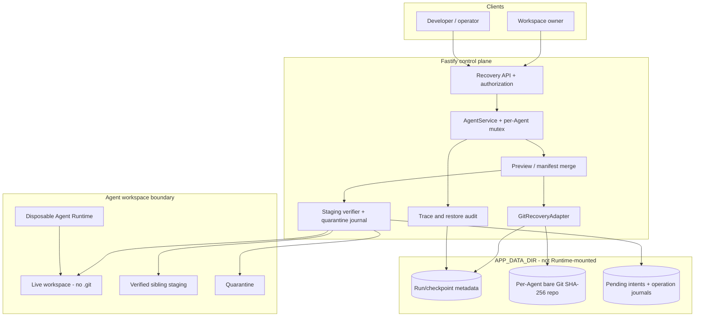

# Git Workspace Recovery Architecture

This document is the implementation contract for Git-backed Agent workspace
recovery. The operational boundary and user behavior are described in
[Workspace Recovery](WORKSPACE_RECOVERY.md).

## Design goals

- Preserve the exact recoverable workspace state before and after each Run.
- Keep checkpoint history beyond the Agent Runtime's reach.
- Let a user choose an understandable Run checkpoint and preview the result.
- Restore selected paths without corrupting unrelated newer work.
- Recover deterministically from a service crash during publication.
- Use Git as a proven object database without exposing general-purpose Git
  commands to agents or API callers.

## Architecture



The Runtime mounts only `WS`. The bare repository, metadata, staging path,
quarantine, and journal are owned by the control plane. No `.git` directory is
created in the workspace.

## Components

### AgentService

`AgentService` owns the Run lifecycle and the per-Agent operation lock. It
passes an explicit locator containing `agentId`, repository identity, and
workspace path to recovery code. The recovery layer never scans all
repositories to discover which Agent owns a checkpoint.

### Git command client

The Git client accepts an allowlisted command and argv array. It uses
`execFile`/spawn without a shell, bounds output and runtime, disables terminal
prompts, and removes inherited environment variables that could redirect the
repository, work tree, index, object storage, or config.

Only these primitives are needed in the recovery path:

```text
init --bare --object-format=sha256
hash-object -w --no-filters --stdin
mktree -z
commit-tree
update-ref
cat-file blob
rev-parse --show-object-format=storage
```

There is no `checkout`, `clean`, or `reset --hard` against the live
workspace. There are no remotes, hooks, fetches, pushes, or user-provided Git
options.

### Git recovery repository

One bare SHA-256 repository belongs to one Agent. The adapter writes exact
regular-file bytes as blobs, constructs workspace and control trees, creates a
commit, and pins it with a platform ref. Reads resolve only commits recorded in
the Agent's checkpoint metadata and extract content through `cat-file blob`.

### Manifest scanner

The scanner performs a stable capture and produces a canonical manifest. Git
blob OIDs prove object identity; the manifest additionally preserves empty
directories, complete portable modes, sizes, and bare-content SHA-256 hashes.
Unsupported entries, path escapes, and unstable files fail the capture.

### Restore transaction

The transaction engine merges selected paths into the current manifest,
hydrates the complete resulting tree into a sibling directory, verifies it,
captures a safety commit, and only then performs a journaled directory swap. It
is separate from Git object creation so a Git command cannot directly overwrite
the active workspace.

## Checkpoint record

A recoverable checkpoint stores at least:

```ts
interface WorkspaceRecoveryCheckpoint {
  storage: "git-sha256-v1";
  repositoryId: string;       // server-side Agent repository identity
  commitOid: string;          // immutable user-selectable restore point
  workspaceTreeOid: string;
  manifestBlobOid: string;
  rootHash: string;           // canonical logical workspace state
  policyId: string;
  fileCount: number;
  totalBytes: number;
  capturedAt: string;
}
```

The commit OID is the durable Git identity. `rootHash` is a logical state hash
that also covers details Git trees omit. Both are verified when loading a
checkpoint.

Old records without `storage: "git-sha256-v1"`, `repositoryId`, and
`commitOid` are legacy CAS checkpoints. They are displayed as unavailable and
cannot enter preview or apply.

## Capture protocol

For every capture:

1. Resolve and validate the Agent workspace under its configured root.
2. Scan all supported entries twice and reject an unstable scene.
3. Send each file to `hash-object -w --no-filters --stdin`.
4. Build nested Git trees bottom-up with NUL-delimited `mktree -z` input.
5. Serialize the canonical manifest and store it as a Git blob.
6. Create the control tree and checkpoint commit with `commit-tree`.
7. Atomically pin the commit with `update-ref` under a pre, post, or safety
   ref.
8. Persist checkpoint metadata before allowing the next lifecycle transition.

Identical content naturally deduplicates in Git's object database. Empty
directories and complete modes remain verifiable through the manifest.

## Preview protocol

The restore UI identifies a checkpoint through an authorized Run. It presents
the short/full commit OID, capture time, and created/modified/deleted summary.
The backend does not accept an unbound OID as authority.

Preview:

1. loads and verifies the target checkpoint;
2. captures the current state;
3. compares current paths with the Run's post state for optimistic conflicts;
4. applies the selection to an in-memory manifest;
5. reports exact create, replace, and delete actions; and
6. returns a short-lived lease bound to all preview inputs and the current root.

No file is changed during preview. Missing/corrupt Git objects, policy changes,
unsupported structures, and legacy checkpoints are visible as blocked previews,
with a redacted reason in both UI and Trace/audit data.

## Apply protocol

Apply reauthorizes the actor and validates the preview lease. Under the same
Agent mutex it:

1. recomputes the current root and returns `409` on any preview drift;
2. loads target file blobs from the Agent's bare repository;
3. hydrates the merged full manifest into a sibling staging directory;
4. verifies bytes, modes, empty directories, and the complete result root;
5. captures the current workspace as a pinned safety commit;
6. persists a pending metadata intent and a `PREPARED` journal;
7. moves the live workspace to quarantine (`QUARANTINED`);
8. moves staging into place (`PUBLISHED`);
9. verifies the active workspace again; and
10. commits the audit and removes the pending intent (`COMMITTED`).

If any publication or final-verification step fails, the transaction restores
quarantine and records `ROLLED_BACK`. The safety commit is retained for
diagnosis and an explicit undo operation.

## Restart reconciliation

At startup, incomplete journal states are reconciled before the Agent may run:

| Journal state | Recovery action |
| --- | --- |
| `PREPARED` | Live workspace was not moved; verify it and remove abandoned staging. |
| `QUARANTINED` | Restore quarantine when no verified publication exists. |
| `PUBLISHED` | Accept only if active root equals planned root; otherwise restore quarantine. |
| Ambiguous/corrupt | Block the Agent and require operator investigation. |

The pending JSON-store intent uses the same operation ID and state hashes. This
lets startup finish an audit when publication succeeded just before process
termination, without reapplying the restore.

## Multi-Agent behavior

- Repositories, refs, journals, and locks are partitioned by Agent.
- Operations for one Agent are serialized, including Run capture and restore.
- Operations for different Agents can execute concurrently.
- A repository ID and workspace path are always supplied together and checked.
- A checkpoint from one Agent can never hydrate another Agent's workspace.

This protects multiple Agents within one service process. Multi-replica use of
the same data root requires a distributed lease and fencing protocol and is not
supported by this POC.

## Security invariants

- All paths are normalized relative paths and resolved below the Agent root.
- Symbolic links and unsupported entries fail closed.
- Git is invoked with fixed argv, bounded output, timeout, and sanitized env.
- The object format must be `sha256`; SHA-1 repositories are rejected.
- File bytes, manifests, external repository paths, and safety refs are not
  returned through overview APIs or ordinary Trace fields.
- Viewer authorization permits preview only; mutation additionally requires
  owner authorization or the recovery operator credential.
- Repository directories and journals must be service-account-only and backed
  up/expired together with checkpoint metadata.

## Startup and deployment gate

The control-plane host, not merely the disposable Runtime image, needs Git 2.29
or newer. `GIT_BIN` may identify an explicit executable; its default is
`git`.

Startup creates a temporary bare SHA-256 repository and verifies its reported
storage format. Failure blocks server readiness with an actionable error. An
existing per-Agent repository is also checked before use.

The production image should run the same probe during build/startup. Local unit
tests with an injected Git runner verify command construction and failure
behavior, but they do not prove interoperability with a real Git binary. The
current development host has no usable Git executable, so no local real-Git
integration pass is claimed. A Linux deployment image with Git must execute the
real repository integration tests before release.

## Acceptance scenarios

1. A Run deletes a file; preview reports one create action for restore and
   applying the selected path recreates its exact bytes and mode.
2. A Run performs a directory-wide refactor; full restore reconstructs the
   exact old tree, including empty directories and file/directory transitions.
3. A user edits a selected path after preview; apply returns `409` and leaves
   the workspace untouched.
4. The service stops after quarantine or publication; restart reconciliation
   either proves the new state or restores the old one.
5. A Git blob, tree, commit, or manifest is missing/corrupt; preview blocks and
   does not mutate the workspace.
6. Two Agents recover concurrently without sharing repositories, refs, staging,
   journals, or locks.
7. A legacy CAS checkpoint remains visible but cannot be selected for apply.
