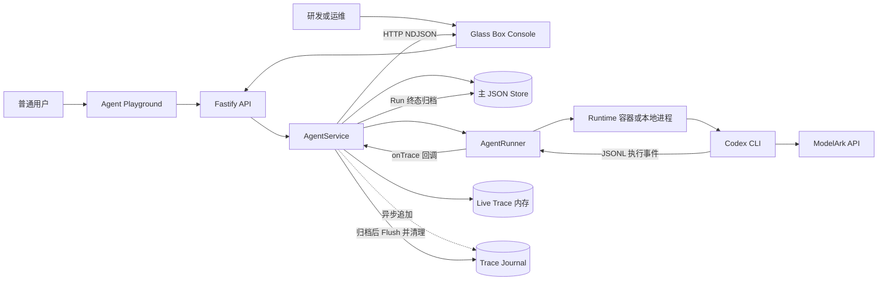
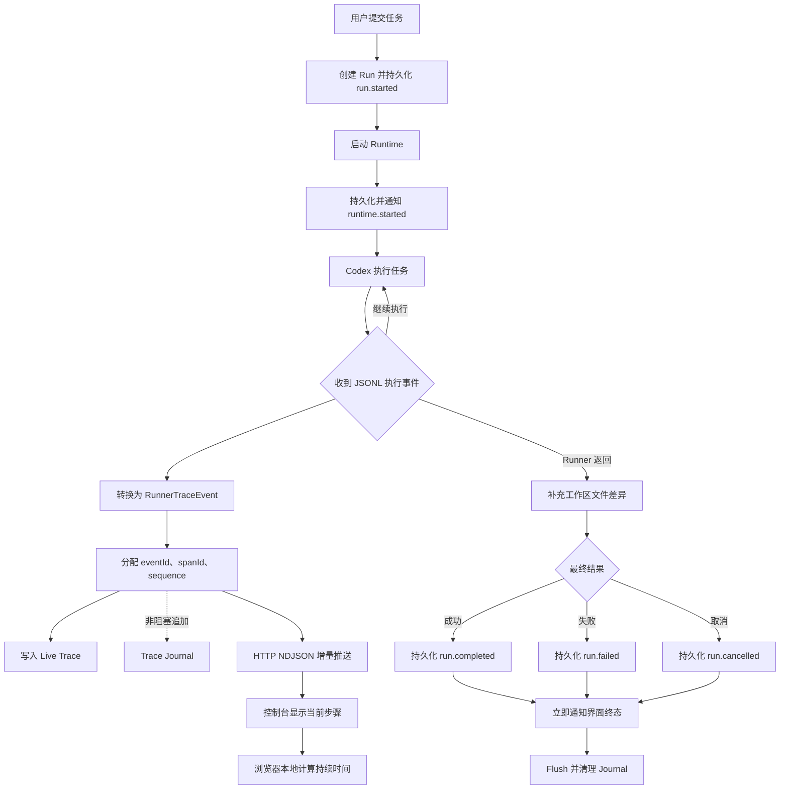
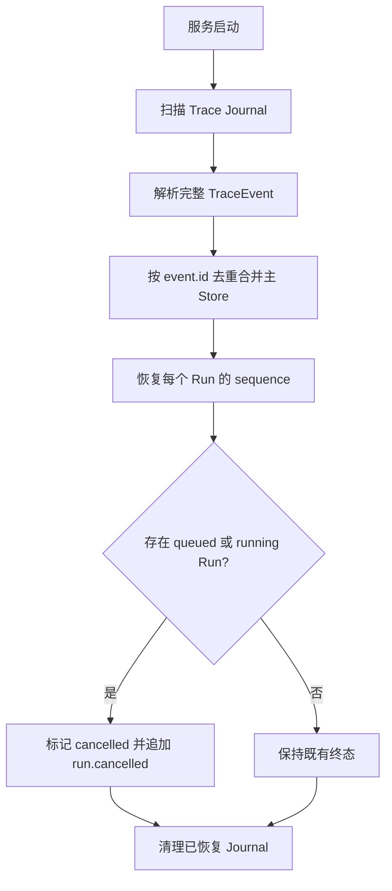

# Glass Box 实时 Agent 可观测性：工作总结与技术设计

## 1. 一句话结论

模型、工具和错误事件已从 Run 结束后的批量归档改造成步骤级实时观测；界面能够显示当前执行位置与持续时间；事件同时通过追加式 Journal 保留，服务异常退出后仍能恢复已经落盘的执行记录。Attempt/Retry 观测契约已经预留，只有回退模块接入 `AttemptTrace` 后才会产生重试事件；恢复 Trace 不会自动续跑任务。

本项目选择比赛的 **Glass Box / Trace & Audit** 赛道。当前成果是黑客松 POC，不等同于生产级链路追踪或压力测试平台。

## 2. 已完成的工作

1. 将 Trace 从 Run 结束后的批量归档改为执行中的逐事件推送。
2. 建立 `runId / traceId / eventId / spanId / attemptId / sequence` 标识体系。
3. 增加每个 Run 一份的追加式 Trace Journal，用于崩溃恢复。
4. 为重试与回退模块预留 `AttemptTrace` 观测接口。
5. 在 Developer Console 中加入当前步骤、实时计时、瀑布关系和回退诊断。
6. 建立行为矩阵脚本，自动验证实时性、错误可见性、多 Run 隔离和 Trace 完整性。

这里的“实时”是**步骤级实时**，不是逐 Token 输出，也不是服务器不断发送心跳。只有执行状态发生变化时才发送事件；当前步骤的持续时间由浏览器每 250 ms 在本地刷新，不额外占用服务端带宽。

## 3. 改造前后对比

| 维度 | 改造前 | 当前实现 |
| --- | --- | --- |
| Trace 到达时机 | Runner 完成后统一保存 | 模型、工具、错误等事件产生后立即推送 |
| 当前执行位置 | 只能查看最终结果 | 可查看当前模型回合、Attempt 或工具步骤 |
| 当前步骤耗时 | 完成后才能计算 | 页面本地时钟持续增长 |
| 步骤关联 | 开始与结束事件难以稳定配对 | 同一操作共享稳定 `spanId` |
| 事件顺序 | 主要依赖时间戳 | 每个 Run 使用单调递增 `sequence` |
| 服务崩溃 | 内存中的运行记录可能丢失 | 每个活跃 Run 使用追加式 Journal |
| 模型与工具错误 | 可能只在最终失败中体现 | `model.failed` / `tool.failed` 实时出现 |
| 重试与回退 | 没有统一观测语义 | 预留 Attempt、Retry 事件与 Helper |
| 演示验证 | 依赖人工逐条输入 | 行为矩阵自动创建多个 Agent 并校验 |

文件变化有两条来源：Runner 能直接识别的事件会立即发送；工作区快照差异会在 Runner 返回后、Run 终态前补齐。因此不能把所有 `file.changed` 都解释为操作发生瞬间的文件系统通知。

## 4. 整体架构



本次改造没有重写官方的 Agent 执行平台。使用本地 POC 启动脚本且 `RUNTIME_PROVIDER=container` 时，每个活跃任务使用一次性 Runtime 容器；Agent 工作区和 Codex 会话目录可以跨任务保留。核心改动主要位于：

```text
AgentRunner → AgentService → HTTP NDJSON → Developer Console
                         ↘ Trace Journal / Store
```

## 5. 实时 Trace Workflow



终态处理顺序是：

1. 将 Runner Trace、Run 结果和终态事件原子写入主 Store；
2. 立即把 `run.completed / run.failed / run.cancelled` 通知界面；
3. 最后等待 Journal 写队列完成并清理文件。

因此慢磁盘导致的 Journal 清理不会拖住界面的终态显示。Journal 清理失败只写服务日志，不会把已经成功的任务改成失败。

## 6. 为什么使用 HTTP NDJSON

实时接口为：

```text
GET /api/developer/runs/:runId/stream
X-Trace-Viewer-Token: <developer token>
```

响应由一行一条 JSON 组成：

```json
{"type":"snapshot","traces":[]}
{"type":"trace","event":{}}
```

当前场景主要是服务端向浏览器单向发送 Trace，不需要 WebSocket 的双向能力。`fetch + ReadableStream` 还可以正常携带开发者鉴权 Header。

为避免订阅建立时漏事件，服务端先注册订阅，再读取快照；快照读取期间到达的事件先进入队列，快照发出后再按 `event.id` 去重发送。晚进入页面的人可以先获得完整快照，再继续接收增量。

## 7. ID 与关联模型

```text
runId / traceId                 一次逻辑用户任务，重试期间不变
└── runtime span                一次 Runtime 执行
    ├── attempt A               第一次尝试
    │   ├── model span          一个模型回合
    │   └── tool span           一次工具调用
    ├── retry.scheduled         A 与下一次尝试的连接
    └── attempt B               第二次尝试
        ├── model span
        └── tool span
```

| 字段 | 职责 |
| --- | --- |
| `runId` | 一次逻辑用户任务；回退期间必须保持不变 |
| `traceId` | 完整 Trace 标识；当前 POC 中等于 `runId` |
| `id` | 单条事件唯一 ID，用于去重 |
| `spanId` | 一个操作的稳定 ID，started 与 terminal 事件共享 |
| `parentSpanId` | 表示 Run、Runtime、Attempt、Model、Tool 的父子关系 |
| `sequence` | Run 内单调递增序号，用于确定顺序 |
| `attemptId` | 一次执行尝试；每次重试必须更换 |
| `retryOfAttemptId` | 当前 Attempt 所重试的上一 Attempt |
| `nextAttemptId` | `retry.scheduled` 预留的下一 Attempt ID |

稳定 Span 让并行工具调用也能正确配对，不再通过“最近的一条 started”猜测完成事件属于谁。Store v4 迁移会为旧数据补充缺失的关联字段，无需清空历史记录。

## 8. 错误与回退语义

| 事件 | 含义 |
| --- | --- |
| `model.failed` | 模型回合失败 |
| `tool.failed` | 工具或命令失败 |
| `attempt.failed` | 一次尝试失败，但仍可能恢复 |
| `retry.scheduled` | 已决定重试，并预留下一 Attempt |
| `run.failed` | 回退策略拒绝或耗尽后，整个任务最终失败 |
| `run.cancelled` | 用户取消或服务重启等导致任务终止 |

必须区分：

```text
tool.failed ≠ run.failed
attempt.failed ≠ run.failed
```

某个工具失败后，Agent 仍可能解释错误并完成任务；第一次 Attempt 失败后，第二次 Attempt 也可能恢复成功。Glass Box 保留中间失败，同时以最终 `run.completed` 表示任务恢复成功。

当前没有实现真正的重试、退避、备用模型或服务器切换；已实现的是观测契约和 `AttemptTrace` Helper。回退模块负责“是否、何时、如何重试”，Glass Box 负责“实时、稳定、可关联地记录和展示”。

## 9. Trace Journal 与崩溃恢复

运行中的 Runner Trace 写入：

```text
<APP_DATA_DIR>/trace-journal/<runId>.ndjson
```

Journal 每个 Run 一份、逐行追加，避免每个步骤都重写主 JSON Store。服务重启时会扫描合法事件，按 `event.id` 去重合并，根据最大 `sequence` 恢复序号；如果最后一行因崩溃只写了一半，只忽略损坏尾行。



重启后不会自动续跑任务。恢复观测记录不等于安全重放带文件或外部副作用的任务。异步追加也保留一个已知窗口：进程在最后一条事件进入系统缓存前被强杀时，该事件仍可能丢失；逐事件同步刷盘虽然更强，但会增加每步延迟。

## 10. 比赛底座与扩展边界

比赛文档的边界是“不要把时间花在重建底座”，并不是说这些文件在 Git 中物理上不能修改。

| 类别 | 内容 | 处理方式 |
| --- | --- | --- |
| 官方底座 | Agent CRUD、Playground、持久化 Workspace、Codex Session、容器 Runtime、ModelArk、可选 ECS | 保持执行语义，按现有接口接入 |
| 本赛道必须证明 | Run 与步骤关联、状态、耗时、错误、可用 Token usage、脱敏、成功与失败案例 | 在后端链路和控制台中实现 |
| 本阶段新增能力 | 实时 NDJSON、稳定 ID、Journal、Attempt/Retry 契约、行为矩阵 | 可继续迭代 |
| 不应混淆的范围 | 登录页、纯 UI 动画、默认容器限制本身 | 不能单独当作 Glass Box 成果 |

验收底线仍然是：中间件必须在后端或 Runtime 链路真实执行，必须有成功与失败案例，核心行为有自动化证据，任何源码、日志、Trace、截图或浏览器中都不能暴露密钥。

## 11. Developer Console 展示

控制台目前能够显示：

- 当前模型、Attempt 或工具步骤以及实时耗时；
- 按 `sequence` 排序的事件列表；
- 用稳定 `spanId` 配对的瀑布关系；
- `attemptId`、回退来源、下一 Attempt 和退避时间；
- `errorCode` 与 `retryable`；
- 中间失败是否被后续 Attempt 恢复；
- Run 级 Token usage、文件变化、工具错误和 Trace JSON。

页面按 `event.id` 去重，因此快照、实时增量和最终查询重复出现同一事件时不会重复展示。

## 12. 行为矩阵与验证

默认矩阵运行 6 个独立 Agent/Run，并发 3：

| 场景 | 份数 | 证明内容 |
| --- | ---: | --- |
| `slow-success` | 2 | 慢步骤实时计时、文件变化、并发隔离 |
| `tool-failure` | 2 | 退出码 42 的实时失败与错误信息 |
| `file-lifecycle` | 1 | 文件创建与工具验证 |
| `ordered-tools` | 1 | 三个工具步骤的顺序、配对与耗时 |

选择 6/3 是为了在普通演示电脑上兼顾说服力和稳定性。默认容器上限为每个 2 CPU / 2 GB，并发 3 的理论上限约为 6 CPU / 6 GB。这里的“6”是同一演示账号下的 6 个独立任务，不是 6 个用户账号。

矩阵证明的是实时协议、Trace 完整性和多 Run 隔离，不是生产压测。生产吞吐结论还需要固定测试时长、P95/P99、资源利用率、背压、慢消费者和受控模型端点。

## 13. 主要代码落点

| 文件 | 职责 |
| --- | --- |
| `apps/server/src/codex-runner.ts` | 逐行解析 Codex JSONL，产生模型与工具事件 |
| `apps/server/src/types.ts` | Trace、Attempt、Retry 数据契约 |
| `apps/server/src/agent-service.ts` | ID、sequence、Live Trace、持久化和 Run 生命周期 |
| `apps/server/src/app.ts` | Developer 查询与 NDJSON 实时接口 |
| `apps/server/src/trace-journal.ts` | 追加式日志和崩溃恢复 |
| `apps/server/src/attempt-trace.ts` | Fallback Runner 的 Attempt 观测 Helper |
| `apps/server/src/store.ts` | Store v4 迁移与原子持久化 |
| `apps/web/src/api.ts` | 浏览器 NDJSON 流读取 |
| `apps/web/src/App.tsx` | 当前步骤、计时、瀑布与回退诊断 |
| `scripts/run-demo-matrix.mjs` | 矩阵执行、校验与报告生成 |
| `scripts/demo-matrix.json` | 默认演示场景 |

## 14. 当前限制

- 尚未实现真正的回退策略，`AttemptTrace` 只是已测试的接入契约。
- 尚未采集 CPU、内存、连接池、队列和网络分段指标，不能自动定位所有拥堵根因。
- Developer Console 总览仍通过轮询发现 Run，进入单个 Run 后才建立该 Run 的实时流。
- 没有断线游标续传、完整背压治理、多进程共享 Trace Hub 或集中式日志平台。
- 主 Store 仍是单进程串行写入、整文件原子替换的 JSON Store。
- 自动化测试不替代真实 ModelArk、Codex 和容器环境的录制前 Smoke Test。

因此当前实现适合黑客松 POC 和受控演示，不应宣称支持生产级数千并发。

## 15. 最终价值

这次改造不是简单“多打一份日志”，而是把 Agent 执行变成结构化、实时、可关联、可恢复的事件链。研发和运维现在可以回答：任务执行到哪里、当前步骤多久、哪一步失败、是否触发回退、后来是否恢复、Run 最终为什么结束，以及服务异常退出前已经发生了什么。
