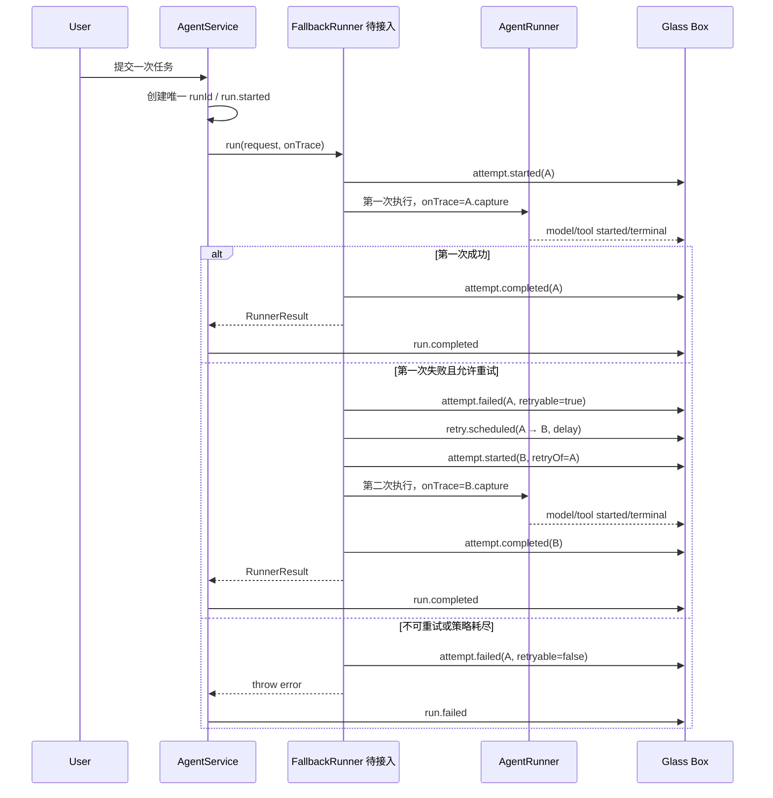

# 回退开发接入说明：Fallback Runner × Glass Box

## 1. 先说结论

这份文档定义回退模块与 Glass Box 之间的接入约定。

**观测端**已经提供稳定 ID、Attempt/Retry 事件、实时推送、Journal、持久化、前端展示和测试 Helper。真正的错误分类、重试次数、退避、备用模型或服务器切换仍由 Fallback Runner 实现。

> Fallback Runner 负责“是否重试、何时重试、换什么再执行”；Glass Box 负责“把每次尝试实时、稳定、可关联地记录和展示”。

`apps/server/src/attempt-trace.ts` 中的 `AttemptTrace` 是正式预留接口，不是已经上线的回退策略。只有将它包在真实 Runner 外层，生产执行才会产生 Attempt 和 Retry 事件。

## 2. 当前执行 Workflow



最重要的终态规则是：

```text
tool.failed       只是一个工具步骤失败
attempt.failed    只是一次执行尝试失败
run.failed        才是整个用户任务最终失败
```

如果第二次 Attempt 恢复成功，第一次失败必须保留，但最终 Run 必须是 `completed`。

## 3. 双方职责边界

| 事项 | Fallback Runner | Glass Box |
| --- | --- | --- |
| 错误分类 | 将异常归一为稳定 `errorCode` | 保存、脱敏并展示 |
| 是否重试 | 设置 `retryable`，执行策略判断 | 不替代策略模块做决策 |
| 次数与退避 | 最大次数、固定/线性/指数退避 | 展示 `retryDelayMs` |
| 回退目标 | 备用模型、端点、Runner 或服务器 | 展示每次 Attempt 的事件 |
| 执行一致性 | 同一逻辑任务复用同一 Run | 分配 `runId / traceId / sequence` |
| Attempt 身份 | 每次尝试创建新的 `attemptId` | 关联 Attempt、Model、Tool Span |
| 取消 | 中断退避和当前底层 Runner | 最终记录 `run.cancelled` |
| 副作用 | 判断能否安全重放或从检查点恢复 | 只记录，不保证幂等 |
| 最终状态 | 成功返回；耗尽后抛错 | 外层生成 `run.completed / run.failed` |
| Journal | 无需直接调用 | 异步追加、恢复、终态后清理 |

Fallback Runner 不需要直接操作 Live Trace、主 Store、Journal、HTTP 流或前端状态，也不应自行分配 `sequence`。

## 4. ID 契约

```text
runId / traceId                 一次逻辑任务，所有重试共用
└── attemptId                   一次尝试，每次重试都变化
    └── spanId                  Attempt 内的一次模型或工具操作
```

必须满足以下规则：

1. 一次用户提交只创建一个 `runId`，回退时禁止创建第二个 Run。
2. `attemptNumber` 从 1 开始连续递增。
3. 每个 Attempt 使用新的 `attemptId`。
4. `retry.scheduled.nextAttemptId` 必须等于下一次 `attempt.started.attemptId`。
5. 下一 Attempt 的 `retryOfAttemptId` 必须等于上一失败 Attempt 的 `attemptId`。
6. 同一模型/工具操作的 started 与 completed/failed 必须沿用底层 Runner 的同一 `operationId`；AgentService 会把它映射为稳定 `spanId`。
7. `event.id`、`traceId`、`parentSpanId` 和 `sequence` 由 AgentService 补齐，Fallback Runner 不要覆盖。

这些 ID 即使没有 React 或断线重连也仍然必要：它们首先解决并行操作配对、重试归属、事件排序、去重和审计一致性问题。

## 5. 事件顺序契约

一次失败后恢复成功的标准序列是：

```text
run.started
runtime.started
attempt.started       attemptId=A, attemptNumber=1
model/tool events     attemptId=A
attempt.failed        attemptId=A, retryable=true, errorCode=TIMEOUT
retry.scheduled       attemptId=A, nextAttemptId=B, retryDelayMs=1000
attempt.started       attemptId=B, attemptNumber=2, retryOfAttemptId=A
model/tool events     attemptId=B
attempt.completed     attemptId=B
run.completed
```

不可重试或耗尽时，最后才由外层 AgentService 产生 `run.failed`。不要在 Fallback Runner 中手工发送任何 `run.*` 事件。

## 6. `AttemptTrace` 的使用方式

最小接入骨架如下。它展示接口用法，不决定具体策略：

```ts
import { AttemptTrace } from "./attempt-trace.js";

let attemptNumber = 1;
let attemptId: string | undefined;
let retryOfAttemptId: string | null = null;

while (true) {
  const attempt = new AttemptTrace(request.onTrace, {
    attemptId,
    attemptNumber,
    retryOfAttemptId,
  });

  try {
    const result = await innerRunner.run({
      ...request,
      onTrace: attempt.capture,
    });
    attempt.complete();
    return result;
  } catch (error) {
    const decision = classifyFailure(error, attemptNumber);
    attempt.fail({
      error,
      errorCode: decision.errorCode,
      retryable: decision.retryable,
    });

    if (!decision.retryable) throw error;

    const nextAttemptId = attempt.scheduleRetry({
      delayMs: decision.delayMs,
    });
    await waitForRetryOrCancellation(decision.delayMs);
    retryOfAttemptId = attempt.attemptId;
    attemptId = nextAttemptId;
    attemptNumber += 1;
  }
}
```

接入动作只有四个：

1. 每次尝试前创建 `AttemptTrace`，构造函数会发送 `attempt.started`。
2. 把底层 Runner 的 `onTrace` 替换为 `attempt.capture`，让模型和工具事件归入该 Attempt。
3. 成功时调用 `attempt.complete()`；失败时先调用 `attempt.fail(...)`。
4. 只有可重试时调用 `scheduleRetry(...)`，并把返回 ID 传给下一 Attempt。

## 7. 错误分类要求

`errorCode` 必须是 1–64 位的大写稳定码，只允许 `A-Z`、数字、下划线、点和短横线。策略必须基于结构化类型或状态码，不要解析展示用的自由文本。

| `errorCode` | 默认建议 | 说明 |
| --- | --- | --- |
| `TIMEOUT` | 可重试 | 前提是操作可重放 |
| `RATE_LIMIT` | 可重试 | 尊重上游 Retry-After |
| `NETWORK` | 可重试 | 仅瞬时连接错误 |
| `UPSTREAM_5XX` | 可重试 | 有次数与退避上限 |
| `AUTH` | 不重试 | 密钥或权限不会靠重试恢复 |
| `VALIDATION` | 不重试 | 输入确定性错误 |
| `TOOL_FAILED` | 默认不重试 | 除非工具明确幂等且错误瞬时 |
| `CANCELLED` | 不重试 | 必须立即结束回退链 |

`retryable` 表示本次策略判断，不是错误类型的永恒属性。达到最大次数后，最后一次失败不能再调度重试。

## 8. 取消、退避与并发

- `cancel(agentId)` 必须同时取消当前底层 Runner 和尚未开始的退避计时器。
- 取消在退避期间到达时，不能再创建下一 Attempt。
- 同一 Agent 仍由 AgentService 限制为一个活跃 Run，不要绕过这个锁。
- 不同 Agent/Run 可以并发，所有可变状态必须按 `agentId` 或 `runId` 隔离，不能放在全局 `currentAttempt` 中。
- Developer Console 断开或 Journal 写入失败不能改变业务结果；观测回调不得成为成功条件。

当前 `RunnerRequest` 没有 `AbortSignal`，所以 Fallback Runner 需要自行维护按 `agentId` 索引的取消控制器，并在 `cancel()` 中清理。以后若扩展 `RunnerRequest.signal`，再统一到标准取消信号。

## 9. 幂等与工作区边界

自动重放完整 Attempt 可能重复写文件、发消息、调用付费 API 或触发外部写入。必须遵守：

1. 认证、校验、取消和确定性工具错误默认不重试。
2. 不可逆操作在没有幂等键、检查点或补偿动作时禁止整段重放。
3. 切换备用 Runner 时仍使用同一 `workspacePath`；是否复用 `threadId` 由回退策略决定，但要有测试。
4. 成功时返回最终实际 Runner 的 `threadId` 和 `output`，不要返回失败 Attempt 的结果。
5. Token usage 只能上报真实可得数据。能获得各 Attempt usage 时应聚合；失败路径拿不到 usage 时要列为限制，不能伪造为 0 成本。

## 10. Journal 与终态的关系

Fallback Runner 不需要等待或清理 Journal。AgentService 的顺序是：

```text
持久化最终 Run + 完整 Trace
→ 立即通知 run.completed / run.failed / run.cancelled
→ Flush 并清理 Journal
```

因此 Journal 慢磁盘不会拖住界面的终态，也不影响回退策略继续判断。Journal 只恢复已经产生的观测记录，不会自动续跑任务。

## 11. 交付前必须通过的用例

| 用例 | 预期结果 |
| --- | --- |
| 第一次成功 | 一个 completed Attempt，最终 `run.completed` |
| 第一次可重试失败、第二次成功 | A failed → scheduled → B completed，最终 `run.completed` |
| 不可重试错误 | 一个 failed Attempt，无 scheduled，最终 `run.failed` |
| 重试耗尽 | 每次 Attempt 均可见，只出现一个最终 `run.failed` |
| 退避中取消 | 不启动下一 Attempt，最终 `run.cancelled` |
| 工具失败但 Runner 正常解释 | 保留 `tool.failed`，不要误判为 `run.failed` |
| 两个 Run 并发 | ID、事件、取消控制器和工作区均不串线 |
| Journal 清理慢 | 终态先在界面出现，业务结果不改变 |

还要断言：`attemptNumber` 连续、`nextAttemptId` 正确衔接、一个 Attempt 只有一个终态、终态后不再调度重试、取消后不产生新 Attempt。

## 12. 可以改与不要绕开的地方

建议新建一个实现 `AgentRunner` 的 Fallback/Retry 装饰器，并在 `runner-factory.ts` 中组合现有 Runner，这样不需要侵入 AgentService。

可修改：

- 回退 Runner、错误分类、策略配置、退避与备用目标；
- 为取消或 Attempt usage 增加必要的类型字段和测试；
- Runner factory 的组合方式。

不要绕开：

- AgentService 对 Run 的创建和最终状态管理；
- `request.onTrace` 这条统一埋点入口；
- 同一任务只使用一个 `runId` 的约束；
- 现有脱敏、Live Trace、Journal 和 Store 链路；
- 一个 Agent 同时只能有一个活跃 Run 的保护。

如果回退策略确实需要修改这些边界，应先对齐契约，不要在回退模块里另建一套 Trace 或状态机。
