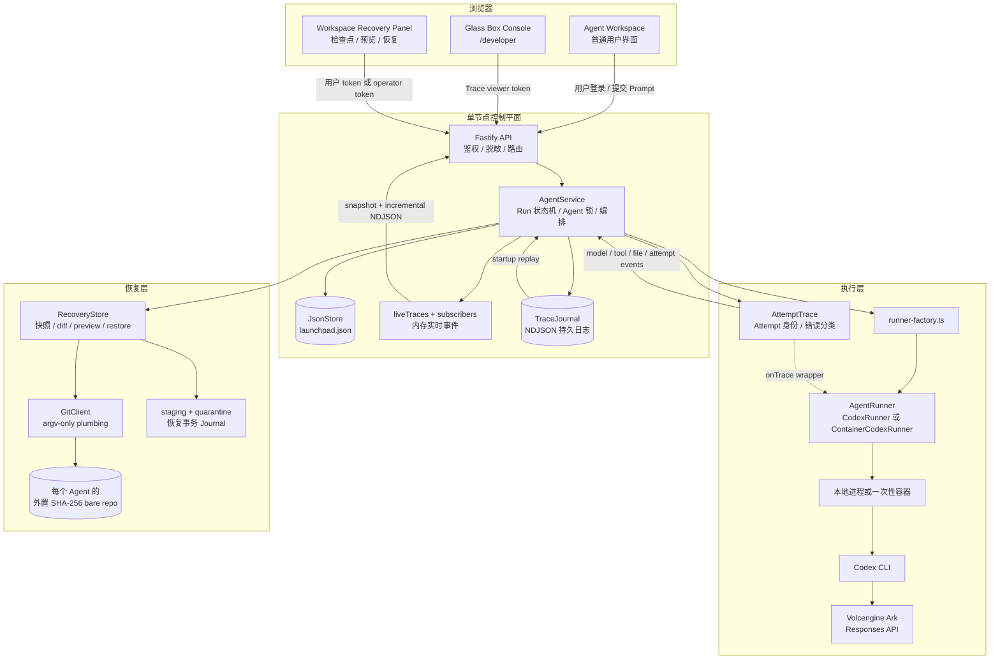
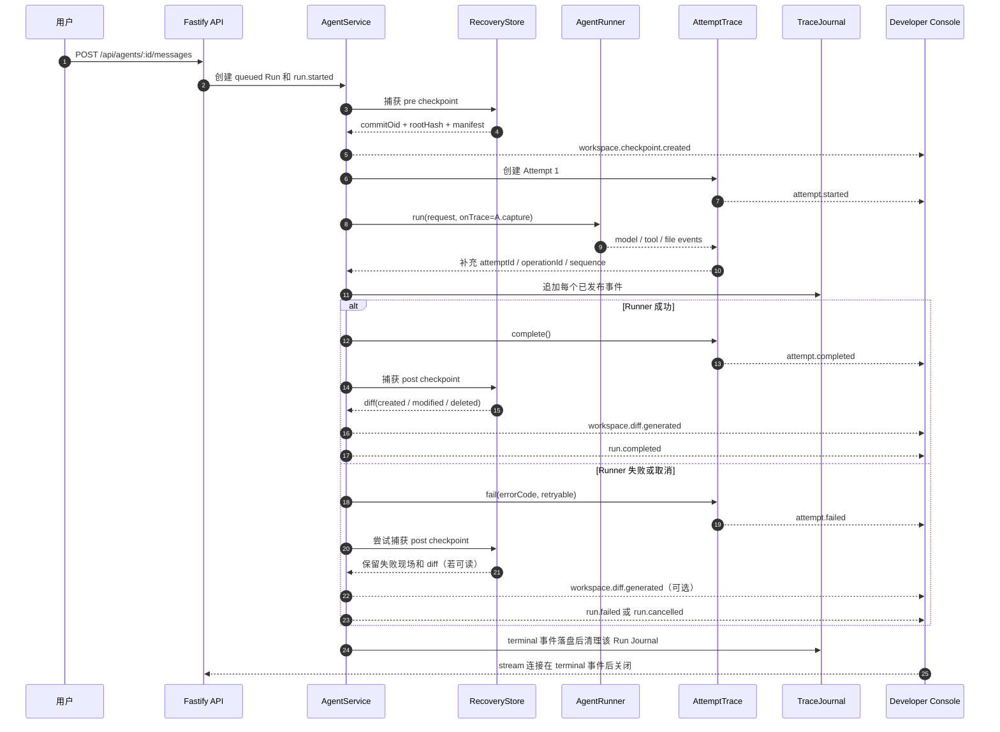
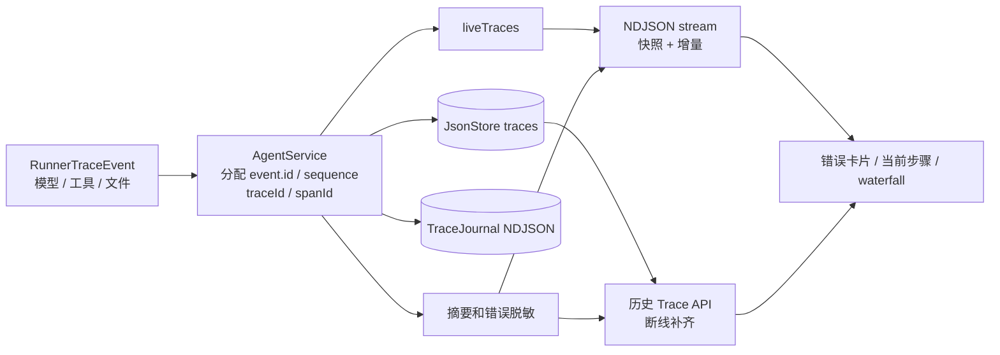
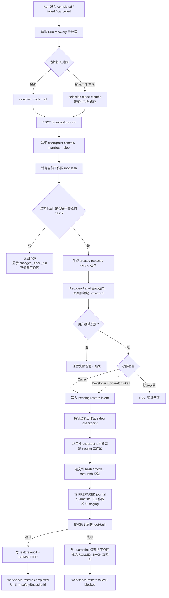
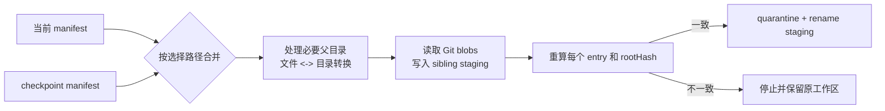
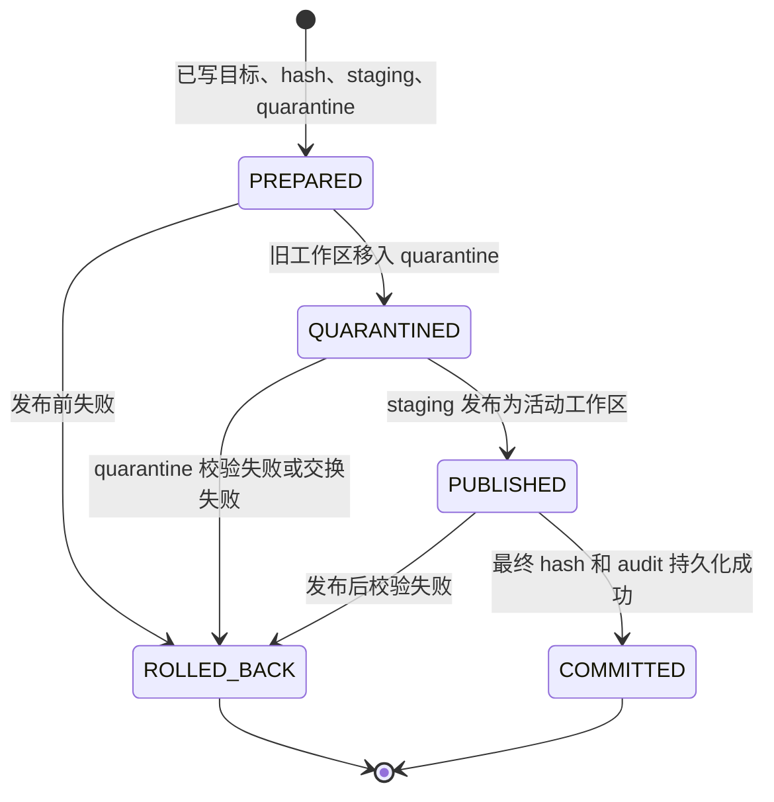
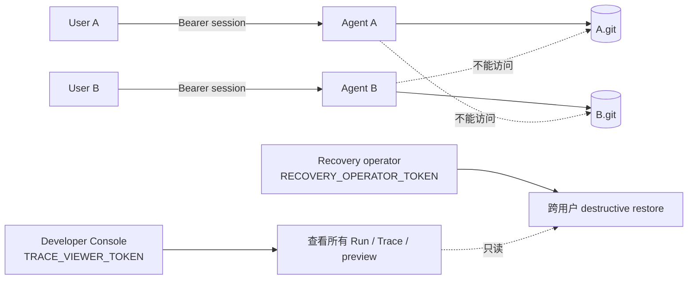

# Trace1 更新功能文档：Glass Box + Git Workspace Recovery

版本：`2026-09-01`<br/>
目标分支：`add-roll-back`<br/>
实现基线：`dev-vale` 的实时 Trace 能力 + Git 工作区恢复能力

本文件是当前代码的功能与技术说明。文中的 Mermaid 图可以直接在
GitHub、GitLab 或支持 Mermaid 的 Markdown 查看器中渲染。

## 1. 产品定位

Trace1 现在是一个带“玻璃盒”执行观测和“可验证工作区恢复”的 Agent
平台 POC：

- 用户可以看到 Agent 正在执行哪一步、哪个模型/工具失败，以及失败是否
  影响了整次 Run。
- 用户可以从某次 Run 绑定的检查点选择文件或目录，先预览再恢复。
- 删除文件、覆盖文件、文件与目录互换、较大的结构性改动，都通过完整的
  工作区快照和原子发布处理。
- 服务重启或进程在恢复过程中中断时，系统会根据 Trace Journal 和恢复事务
  日志继续核对现场，而不是假设操作已经成功。

当前实现刻意不自动切换模型或自动重试；它先把每次 Attempt 的事实记录
完整，为后续接入幂等的 Fallback Runner 留出稳定边界。

## 2. 功能总览

| 能力 | 用户可见结果 | 主要实现 |
| --- | --- | --- |
| Run Trace | 实时时间线、当前执行步骤、耗时、Token 用量、错误摘要 | `AgentService`、`TraceEvent`、React Developer Console |
| Attempt 观测 | 区分工具失败、Attempt 失败和 Run 最终失败 | `AttemptTrace` |
| NDJSON 实时流 | 运行中无需刷新页面即可收到事件；断线后可由历史 Trace 补齐 | `GET /api/developer/runs/:id/stream` |
| Trace Journal | 进程重启后恢复尚未写入主 Store 的事件 | `APP_DATA_DIR/trace-journal/*.ndjson` |
| Git 检查点 | 每次 Run 前后保存不可变 SHA-256 检查点 | 每个 Agent 一个外置 bare Git 仓库 |
| 差异预览 | 显示 created / modified / deleted 和具体恢复动作 | `RecoveryStore.previewRestore` |
| 选择性恢复 | 只恢复用户选中的路径，支持恢复删除的文件 | `RecoveryPanel` + manifest merge |
| 冲突保护 | 预览后工作区被改动时，恢复返回 `409`，不覆盖新改动 | root hash + 短期 preview lease |
| 原子发布 | staging 校验完成后再交换工作区，保留 quarantine | durable restore journal |
| 崩溃恢复 | 恢复中断时重启后继续判断、回滚或阻断 Agent | `PREPARED` 到 `COMMITTED` 状态机 |
| Git/MinGit | Windows PATH、Git for Windows、MinGit 自动发现，也支持 `GIT_BIN` | `git-client.ts`、启动脚本 |

## 3. 总体架构



### 3.1 组件职责

| 组件 | 责任 | 不负责的事情 |
| --- | --- | --- |
| `AgentService` | 创建 Run、分配序号、协调 Runner、写入状态、发布 Trace、调用恢复层 | 不决定模型供应商的重试策略 |
| `AttemptTrace` | 为一次尝试生成 `attemptId`，接收底层事件，记录完成/失败和 retry metadata | 不自动发起下一次 Attempt |
| `TraceJournal` | 按 Run 追加 NDJSON，重启时校验并合并有效事件 | 不重放 Agent 任务，不改变 Run 业务结果 |
| `RecoveryStore` | 捕获快照、生成差异、校验冲突、构建 staging、发布或回滚工作区 | 不回滚外部 API、数据库、邮件或已消耗 Token |
| `GitRecoveryRepository` | 将 manifest、tree、blob 和 commit 写入每个 Agent 的 bare repo | 不把 `.git` 放入 Agent 工作区 |
| `RecoveryPanel` | 让用户选择路径、查看动作、输入 operator token、执行恢复 | 不直接执行 Git 命令 |

### 3.2 目录与数据隔离

```text
APP_DATA_DIR/
  launchpad.json                         # Agent、Run、Trace 元数据
  trace-journal/<runId>.ndjson           # 运行中的临时 Trace Journal
  recovery/
    repositories/<agentId>.git/          # 外置 SHA-256 bare Git 对象库
    operations/<operationId>.json        # 恢复事务日志

AGENT_WORKSPACE_ROOT/
  <agentId>/                             # Agent Runtime 可见的工作区
  .deleted/                              # 平台隔离的旧工作区（如启用）

CODEX_HOME/
  config.toml                            # 由环境变量生成，不写入 API Key
```

Agent 工作区没有平台 `.git`。运行时不能通过删除工作区中的 `.git` 破坏
恢复历史，也不能访问其他 Agent 的 bare repository。

## 4. 一次 Run 的完整执行流程



### 4.1 事件如何变成用户可见的错误

底层 Runner 只产生操作事实，服务端负责统一身份、顺序和脱敏：



用户在界面看到的是以下层级，而不是一堆无上下文日志：

```text
tool.failed        某个模型工具调用失败
attempt.failed     一次完整执行尝试失败，带 errorCode/retryable
retry.scheduled    外层策略决定稍后创建下一次 Attempt（当前 POC 不自动产生）
run.failed         整个用户 Run 最终失败
workspace.diff...  失败现场相对 pre checkpoint 的文件变化
```

当前实现中的 `file.changed` 主要由执行前后的工作区快照差异补齐，表示
“最终检测到的文件变化”，不承诺对每一次底层写入都实时发出通知。

### 4.2 Trace 事件字段

| 字段 | 作用 |
| --- | --- |
| `id` | 单事件去重键；断线重连不会重复渲染 |
| `runId` / `traceId` | 将所有事件归入一次用户任务；当前 POC 通常相同 |
| `spanId` / `parentSpanId` | 展示模型、工具和 Attempt 的父子关系 |
| `sequence` | 同一 Run 内稳定递增，解决并发事件排序 |
| `attemptId` / `attemptNumber` | 标识第几次执行尝试 |
| `operationId` / `parentOperationId` | 关联底层模型或工具操作 |
| `errorCode` | 结构化错误，如 `TIMEOUT`、`RATE_LIMIT`、`AUTH` |
| `retryable` | 本次错误是否允许外层策略重试，不等于已经重试 |
| `summary` / `error` | 脱敏后的用户可读摘要和错误信息 |

## 5. 回滚/恢复流程

用户不会输入任意 Git ref，而是在 Run 的恢复面板中选择已绑定的检查点。
典型流程如下：



### 5.1 删除文件的具体例子

假设 pre checkpoint 有 `important.txt`，某次 Run 将它删除并新建
`unwanted.txt`：

| pre checkpoint | 当前工作区 | 预览动作 |
| --- | --- | --- |
| `important.txt` 存在 | 不存在 | `create`：从 checkpoint 读取并重建 |
| `settings.json` 为稳定版本 | 被覆盖 | `replace`：替换为 checkpoint 内容 |
| 无 `unwanted.txt` | 当前存在 | `delete`：删除当前新增文件 |

恢复不会直接执行 `git reset --hard`。它先在同级 staging 目录中重建整个
目标状态，再一次性交换目录，因此文件删除、文件覆盖和文件/目录类型变化
不会留下半完成状态。

### 5.2 结构性大修为何能保持一致

每个 checkpoint 同时保存：

1. 规范化 manifest：相对路径、entry kind、完整 portable mode、大小和
   文件 SHA-256。
2. Git tree/blob：regular file 的原始字节通过 `hash-object --no-filters`
   写入，避免换行或 attributes 改写内容。
3. `rootHash`：对完整工作区状态的确定性摘要。

恢复时不是逐个文件直接覆盖，而是做 manifest merge：



因此大规模目录重构也只有两种结果：完整发布目标状态，或原状态保持不变。

## 6. 恢复事务与重启现场

恢复操作的 durable journal 状态：



服务启动时会逐项检查：

- 活动工作区是否匹配 `expectedRootHash` 或 `resultingRootHash`；
- staging/quarantine 是否仍存在且路径在受控目录内；
- safety checkpoint 是否能由 Git ref 解析并与 hash 对齐；
- JSON Store 中的 `pendingRestores` 是否已经有对应 audit。

无法证明恢复结果时，系统不会猜测成功，而是保留 pending intent、把 Agent
置为需要处理的状态，并发出 `workspace.restore.blocked`。这使“现场”包括
原工作区、quarantine、staging、事务日志、safety commit 和 Trace 审计。

## 7. 多 Agent 隔离与权限



| 操作者 | 查看自己的 Run | 查看跨用户 Trace | 预览恢复 | 执行跨用户恢复 |
| --- | --- | --- | --- | --- |
| 普通用户 Owner | 是 | 否 | 是 | 是自己的 Run |
| Developer（viewer token） | 按开发者权限 | 是 | 是 | 否，仅有 viewer token 时返回 `403` |
| Recovery operator | 取决于 viewer/开发者权限 | 是 | 是 | 是，需额外 `RECOVERY_OPERATOR_TOKEN` |

所有 API 日志会脱敏 `Authorization`、Trace viewer token、Recovery operator
token；恢复 token 只在开发者浏览器 session 中暂存，并只随 restore 请求发送。

## 8. HTTP 接口

| 方法 | 路径 | 认证 | 用途 |
| --- | --- | --- | --- |
| `GET` | `/api/developer/runs/:id/trace` | `X-Trace-Viewer-Token` | 获取已持久化 Trace |
| `GET` | `/api/developer/runs/:id/stream` | `X-Trace-Viewer-Token` | snapshot + 增量 NDJSON；terminal 后关闭 |
| `GET` | `/api/developer/runs/:id/recovery` | `X-Trace-Viewer-Token` | 查看检查点和文件变化 |
| `POST` | `/api/developer/runs/:id/recovery/preview` | viewer token | 生成短期预览、动作和冲突 |
| `POST` | `/api/developer/runs/:id/recovery/restore` | viewer + operator token | 执行跨用户恢复 |
| `GET` | `/api/runs/:id/recovery` | Owner session | 查看自己的恢复信息 |
| `POST` | `/api/runs/:id/recovery/preview` | Owner session | 预览自己的恢复 |
| `POST` | `/api/runs/:id/recovery/restore` | Owner session + `Idempotency-Key` | 执行自己的恢复 |

恢复请求核心字段：

```json
{
  "checkpointId": "sha256 commit locator from the Run",
  "previewId": "short-lived preview id, required on restore",
  "selection": {
    "mode": "paths",
    "paths": ["recovery-smoke-test/important.txt"]
  }
}
```

执行 restore 必须携带新的 `Idempotency-Key`。重复提交同一 key 不会产生
第二次恢复审计；预览过期或工作区 hash 改变时必须重新预览。

开发者实时流的线协议是“一行一个 JSON”：

```text
{"type":"snapshot","traces":[{"id":"...","runId":"...","sequence":1}]}
{"type":"trace","event":{"id":"...","type":"attempt.failed","sequence":7,"errorCode":"TIMEOUT","retryable":true}}
```

恢复请求使用以下请求头：

| 请求头 | 使用场景 | 说明 |
| --- | --- | --- |
| `X-Trace-Viewer-Token` | Developer Trace、Developer recovery | 只读查看和预览门禁 |
| `X-Recovery-Operator-Token` | Developer destructive restore | 额外的跨用户写入门禁 |
| `Idempotency-Key` | 所有 restore | 防止重复提交同一恢复操作 |

常见错误状态：

| 状态码 | 含义 | 工作区是否改变 |
| --- | --- | --- |
| `400` | 请求体或路径选择不合法 | 否 |
| `403` | viewer、owner 或 operator 权限不足 | 否 |
| `404` | Run、Agent 或 Git 检查点不存在 | 否 |
| `409` | Agent 忙、预览过期、root hash 漂移、恢复冲突或待协调事务 | 否（除非返回明确的已完成操作） |
| `200` | preview 或 restore 成功 | preview 否；restore 是 |

## 9. Git 与 MinGit 实现细节

- 要求 Git `2.29+`，并在启动时实际创建
  `git init --bare --object-format=sha256` 探测，而不是只看版本字符串。
- `GIT_BIN` 显式配置优先；Windows 下还会扫描 PATH、Git for Windows、
  `%LOCALAPPDATA%/Programs/Git` 和最新的 `MinGit-*` 目录。
- 所有 Git 调用都是 argv 数组、`shell: false`，不会把带空格的路径拼成
  shell 命令。
- 只依赖本地 plumbing：`hash-object`、`cat-file`、`mktree`、`commit-tree`、
  `update-ref`、`rev-parse` 和 `init`；不需要 remote helper。
- Agent 工作区不需要预先存在 Git 仓库，也不需要用户安装 Git 项目配置。
- 如果 Git 不在 PATH，Windows 启动脚本会自动发现 MinGit；也可以直接设置：

```powershell
$env:GIT_BIN = "C:\Users\<user>\AppData\Local\Programs\MinGit-2.54.0\cmd\git.exe"
```

## 10. 前端如何操作

1. 启动服务后打开 `http://127.0.0.1:3000/developer`。
2. 输入启动脚本打印的 Trace viewer token，进入用户 → Agent → Run。
3. 运行中查看当前步骤、事件瀑布和失败卡片；断线后页面会用历史接口补齐。
4. Run 结束后，在 `Workspace recovery` 面板查看 before/after hash 和
   created/modified/deleted 数量。
5. 勾选要恢复的路径，点击预览；先确认每个 `create`、`replace`、`delete`
   动作和冲突列表。
6. Developer 还需输入启动脚本打印的 Recovery operator token；普通用户
   恢复自己的 Run 不需要该跨用户 token。
7. 恢复成功后面板显示恢复路径、`safetySnapshotId` 和新的状态 hash；同时
   Trace 中出现 `workspace.restore.completed`。

## 11. 本地演示步骤

Windows 推荐使用脚本，避免 PowerShell 将 `npm.ps1` 判为禁止执行：

```powershell
cd D:\kaggle\hacthon\trace1-Agent-
.\scripts\start-local-windows.ps1
```

启动时只在隐藏提示中输入真实 `ARK_API_KEY`，`ARK_MODEL` 填 Endpoint 或
Model ID（例如 `ep-xxxxxxxx`），不要把 API key 写入文档、代码或提交记录。

建议用两个 Run 验证删除回退：

```text
Run 1：只创建 recovery-smoke-test/important.txt，内容为 ORIGINAL IMPORTANT CONTENT。
Run 2：只删除 important.txt，并创建 unwanted.txt；明确要求 Agent 不要自行恢复。
```

在 Run 2 的 recovery panel 选择 `important.txt`，预览应显示 `create`；
执行后 `important.txt` 恢复，`unwanted.txt` 保持不变（若只选择单文件）。
选择 `Preview all changes` 时，预览会同时显示删除新增文件、替换被覆盖文件
等动作。

## 12. 验证结果

当前 `add-roll-back` 分支已验证：

- `npm.cmd run typecheck`：通过；
- `npm.cmd run test:matrix`：`13/13` 通过；
- 服务端单线程测试：`13` 个测试文件、`102/102` 通过；
- `npm.cmd run build`：Web Vite 构建和 Server TypeScript 构建通过；
- MinGit `2.54.0.windows.1`：真实 SHA-256 bare repo 完成 checkpoint、删除、
  preview 和 exact-byte restore；
- 健康检查、系统能力检查、stream 鉴权和不存在 Run 的 `404` 已通过 smoke test。

Windows 某些环境下 Vitest 默认 worker 可能不主动退出；使用单 worker 参数
可以得到确定的退出结果，不影响测试断言。

## 13. 当前边界与下一步扩展

目前已经完成的是“可观测、可审计、可恢复”的基础设施，尚未启用自动
Fallback：

- `AttemptTrace` 会记录 `retryable`、`retryOfAttemptId`、`nextAttemptId` 和
  `retryDelayMs`，但 `runner-factory.ts` 仍返回单一 Runner。
- 真正接入自动重试或备用模型时，应在 Runner 外层增加装饰器，复用同一
  `runId`、每次新建 `AttemptTrace`，并为不可幂等副作用配置明确策略。
- 若重试会修改工作区，建议每个 Attempt 都绑定 pre/post checkpoint，或在
  重试前使用当前 safety checkpoint 恢复到可证明状态。
- 生产环境还需要 HTTPS、细粒度 RBAC、集中式日志、加密存储、保留周期和
  分布式锁；当前实现是单控制平面 POC。

## 14. 代码索引

| 文件 | 说明 |
| --- | --- |
| `apps/server/src/agent-service.ts` | Run 状态、Trace 编排、检查点和恢复 API 的业务协调 |
| `apps/server/src/attempt-trace.ts` | Attempt 生命周期和 retry metadata |
| `apps/server/src/trace-journal.ts` | NDJSON Trace Journal 和启动恢复 |
| `apps/server/src/git-client.ts` | Git/MinGit 可执行文件发现和安全进程封装 |
| `apps/server/src/git-recovery-repository.ts` | bare Git 对象、tree、commit、ref |
| `apps/server/src/recovery-store.ts` | 快照、diff、预览、staging、quarantine、事务恢复 |
| `apps/server/src/app.ts` | Trace、stream、recovery 路由和鉴权 |
| `apps/web/src/App.tsx` | Developer Console、实时 Trace 和 waterfall |
| `apps/web/src/RecoveryPanel.tsx` | 选择路径、预览冲突和执行恢复 |
| `docs/WORKSPACE_RECOVERY.md` | Git 恢复算法和安全边界的深入说明 |
| `docs/RETRY_TRACE_CONTRACT.md` | 后续 Fallback Runner 接入契约 |
| `docs/ROLLBACK_DEMO.md` | 可执行的删除/恢复演示脚本 |
