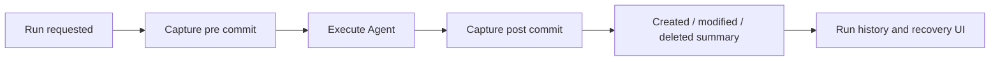

# Workspace Recovery

Agent Launchpad provides run-level recovery for platform-managed Agent
workspaces. Git is the durable object and checkpoint store, while a platform
manifest records filesystem details that Git trees cannot represent on their
own.

This is recovery of workspace files, not reversal of every Agent side effect.

## What can be recovered

Recovery covers regular files and directories inside one Agent workspace. It
can reconstruct files that a Run created, modified, deleted, renamed, or moved,
including large structural changes where a path changes between a file and a
directory.

It does not recover:

- process or container memory;
- consumed model tokens;
- external API, database, email, payment, or MCP side effects;
- operating-system metadata outside the recorded portable mode; or
- the previous Codex conversation state. After a successful restore, the saved
  Codex thread is cleared so a later Run cannot continue with stale filesystem
  assumptions.

Symbolic links and unsupported filesystem entries fail closed. Snapshot file
count and byte limits still apply. A checkpoint proves only the state covered
by the configured workspace policy.

## Storage isolation

Each Agent has a separate bare Git repository below the control-plane data
directory. Git metadata is never placed in the Agent workspace:

```text
APP_DATA_DIR/
  recovery/
    repositories/
      <agentId>.git/       bare Git SHA-256 object database and refs
    operations/            durable restore journals

AGENT_WORKSPACE_ROOT/
  <agentId>/               mounted into the Agent Runtime; no platform .git
```

The Agent Runtime sees only its workspace. It cannot delete recovery history
with `rm -rf .git`, rewrite refs, install hooks, or access another Agent's
objects. The repositories are local recovery data, not remote backups and not
user project repositories.

## Git object model

The service requires Git 2.29 or newer and initializes every repository with:

```text
git init --bare --object-format=sha256
```

It verifies the actual storage object format before accepting an existing
repository. A SHA-1 repository is rejected rather than silently mixed with
SHA-256 checkpoints.

The recovery adapter exposes only a small plumbing surface and invokes Git with
an argument array, never a shell command string:

```text
hash-object -w --no-filters --stdin
mktree -z
commit-tree
update-ref
cat-file blob
```

`hash-object --no-filters` makes the stored blob represent the exact bytes read
from disk, independent of attributes, line-ending filters, or a user's Git
configuration. The process also strips inherited `GIT_DIR`, `GIT_WORK_TREE`,
index, object-alternate, and config-count variables; disables prompts; and uses
a controlled environment.

Every checkpoint commit points to a control tree containing:

```text
checkpoint commit
`-- control tree
    |-- manifest.json
    `-- workspace/          Git tree of regular file content
```

The manifest is canonical and ordered. For each path it records:

- entry kind and normalized relative path;
- the complete portable mode;
- file size;
- SHA-256 of the bare file bytes; and
- the Git SHA-256 blob OID for regular files.

It also records directories, including empty directories. This supplement is
necessary because Git trees do not preserve empty directories and retain only
a subset of POSIX mode bits. A checkpoint is accepted only when its manifest,
tree, blobs, and computed workspace state agree.

## Refs and Run lifecycle

Before a Run starts, the service captures and persists a `pre` checkpoint. It
captures a `post` checkpoint after every terminal outcome, including failure or
cancellation when the workspace remains readable. A restore captures the
current workspace as a `safety` checkpoint before publication.

Pinned refs are namespaced by Agent and operation, conceptually:

```text
refs/launchpad/runs/<runId>/pre
refs/launchpad/runs/<runId>/post
refs/launchpad/safety/<operationId>
```

The durable Run record stores the repository identity and commit OID. The Run
does not begin if its `pre` checkpoint cannot be created and recorded.



## Choosing a restore point

Users do not type an arbitrary Git ref. The UI lists checkpoints already bound
to Runs they are authorized to access. Each option shows the Run, capture time,
checkpoint kind, short commit OID, and a summary of created, modified, and
deleted paths. The complete commit OID is the immutable restore-point identity.

The API resolves that OID through the Run record and verifies that it belongs
to the same Agent repository. This prevents one Agent from restoring another
Agent's commit even if an OID is disclosed.

Selecting a checkpoint opens a preview first. The preview verifies all required
objects and reports the concrete create, replace, and delete actions. It also
reports structural conflicts and any paths changed after the selected Run.
Errors are visible in the recovery panel and emitted as correlated Trace/audit
events; raw file contents and internal repository paths are not exposed.

## Selective restore

A selective restore is a manifest merge, not a `git checkout` or
`git reset --hard` against the live directory:

1. Capture and hash the current workspace.
2. Verify it still matches the state used by the short-lived preview.
3. Load the target checkpoint by its recorded commit OID.
4. Replace only the selected paths and necessary ancestors in the current
   manifest, handling file-to-directory and directory-to-file transitions.
5. Read required blobs with `cat-file blob` and hydrate a complete sibling
   staging workspace.
6. Verify every file hash, mode, empty directory, and the resulting root state.
7. Capture and pin a safety checkpoint of the current workspace.
8. Publish the verified staging directory through the crash journal.

Building a complete sibling workspace means a structural refactor can be
restored consistently: the service never leaves half of the old tree mixed with
half of the selected tree. Paths outside the selection retain their current
manifest entries unless a required structural ancestor makes that impossible;
such ambiguity is returned as a conflict during preview.

## Conflict and concurrency guards

Preview returns an expected current-state hash and a short-lived lease bound to
the actor, Agent, Run, checkpoint, and selected paths. Apply recomputes the
complete current state. A mismatch returns `409 Conflict` and changes nothing.

Run, capture, preview/apply, and restart reconciliation are serialized per
Agent. Different Agents use different repositories and locks, so their recovery
operations can proceed independently. This is a single-control-plane design;
the in-process locks are not distributed locks.

## Atomic publication and crash recovery

The service does not ask Git to mutate the live worktree. Once staging is fully
hydrated and verified, a durable journal controls the directory swap:

```text
PREPARED -> QUARANTINED -> PUBLISHED -> COMMITTED
    |            |             |
    +------------+-------------+-> ROLLED_BACK
```

- `PREPARED`: target commit, selected paths, expected/current hashes, staging,
  quarantine, and safety commit are durable before mutation.
- `QUARANTINED`: the former workspace has moved to quarantine.
- `PUBLISHED`: the verified staging workspace is active.
- `COMMITTED`: final verification and metadata/audit persistence succeeded.
- `ROLLED_BACK`: the quarantined workspace was restored after a failure.

On startup, the service reconciles incomplete journals with the active
workspace, quarantine, target state, and safety commit. It accepts a published
workspace only when its exact state can be proven; otherwise it restores the
quarantine or blocks the Agent for operator review. A matching pending intent
in the JSON store closes the gap between filesystem publication and audit
persistence.

## Legacy checkpoints

Checkpoints created by the earlier custom CAS format do not contain a Git
repository identity and Git commit OID. They remain visible as historical Run
metadata, but the Git recovery adapter marks them unavailable for restore. It
does not guess, silently import, or reinterpret a legacy root hash as a Git
object ID.

A deliberate offline migration tool could be added later. Until then, keep the
old recovery directory if historical evidence is required and create a new Git
checkpoint before offering restore for an existing workspace.

## Authorization

Owners may inspect and restore only their own Runs using normal user
authentication. The Developer Console separates observation from mutation:

- `TRACE_VIEWER_TOKEN` grants read and preview access.
- `RECOVERY_OPERATOR_TOKEN` additionally authorizes a cross-user restore.
- `RECOVERY_OPERATOR_ID` is a stable, non-secret identity in audit records.

Never reuse the viewer token as the recovery token. Repository paths, Git
process environment, raw manifests, and file contents are server-private.

## Startup capability probe

Startup fails closed when recovery cannot guarantee its object format. The
probe must:

1. locate the configured `GIT_BIN` (default `git`) and read its version;
2. require Git 2.29 or newer;
3. create a temporary bare repository with `--object-format=sha256`;
4. verify `rev-parse --show-object-format=storage` reports `sha256`; and
5. remove the temporary probe repository after success or failure.

Production images install Git in the control-plane runtime. Installing Git only
inside the disposable Agent Runtime is insufficient because the control plane,
not the Agent, owns checkpoint creation and restore.

## Operations and verification status

Recovery repositories contain complete workspace content. Keep
`APP_DATA_DIR/recovery` outside Runtime mounts, restrict it to the service
account, encrypt disks and backups, monitor disk use, and expire refs and Run
metadata together through an operator-controlled retention process. Do not
delete loose Git objects manually.

The command adapter and recovery behavior can be tested with injected runners
and deterministic fixtures on a host without Git. That does not replace an
integration test against a real Git SHA-256 repository. This development host
does not currently provide a usable Git executable, so the documentation does
not claim that a local real-Git integration test has passed. The deployment
image must run the startup capability probe and the real integration suite.
